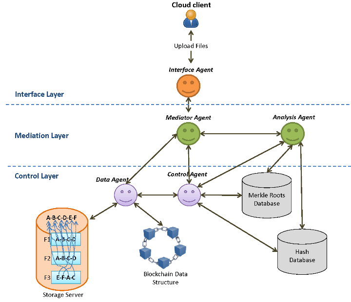

# 📘 Maestro Orchestrator — Multi-Agent Orchestration Framework

<p align="center">
  <!-- Repository Status -->
  <a href="https://github.com/japan1988/multi-agent-mediation/stargazers">
    
  </a>
  <a href="https://github.com/japan1988/multi-agent-mediation/issues">
    
  </a>
  <a href="./LICENSE">
    
  </a>
  <a href="https://github.com/japan1988/multi-agent-mediation/actions/workflows/python-app.yml">
    
  </a>
  <br/>
  <!-- Technical Meta -->
  
  
  
  
  
</p>

---

## 🎯 Purpose / 目的

本リポジトリは、複数エージェント（または複数手法）を統括し、**誤り・危険・不確実**を検知した場合に **停止（STOP）／分岐（REROUTE）／人間へ差し戻し（HITL）** を行うための **研究用オーケストレーション（Orchestration）フレームワーク**です。

主眼は「交渉そのもの」ではなく、次の統括機能です：

- **Routing**: タスク分解と担当割当（どのエージェントに何をさせるか）
- **Guardrails**: 禁止・越権・外部副作用の封印（fail-closed）
- **Audit**: いつ何を理由に止めたかのログ化（証跡）
- **HITL**: 判断不能や重要判断は人間へエスカレーション
- **Replay**: 同条件で再実行し、差分検知できるようにする

---

## 🔒 Safety Model (Fail-Closed) / 安全モデル（Fail-Closed）

このリポジトリは **教育・研究目的**であり、**安全性は fail-closed を優先**します。

- 入力／出力／計画（plan）において **禁止意図、越権、確信不足、曖昧なセンシティブ意図** を検知した場合、**自動実行はしない**  
  → **STOP** または **HITL（PAUSE_FOR_HITL）** に落とします。
- 「危険かもしれない」状況で **別エージェントに振り替えて継続する（fail-open reroute）** ことは避けます。  
  （禁止カテゴリや越権は、rerouteではなく停止が優先。）

---

## 🌍 External Side Effects (Definition & Allowlist) / 外部副作用（定義と許可リスト）

**外部副作用**とは、外部状態を読み書きし得る行為を指します（例）：

- ネットワークアクセス（read/write）
- ファイルシステムアクセス
- コマンド実行
- メッセージ送信（メール/DM等）
- 課金・購入・アカウント操作
- 連絡先/CRM/メールボックス等の **PIIソース** へのアクセス

**Default policy: deny-by-default（デフォルト拒否）**
- Network: **DENY**（明示的に許可した研究実験のみ例外）
- Filesystem: **DENY**（必要ならログ出力先など最小範囲に限定）
- Command execution: **DENY**
- Messaging / email / DM: **DENY**
- Payments / billing: **DENY**
- PII sources（contacts / CRM / mailbox 等）: **DENY**
- Unknown tools: **DENY**

ツールを追加する場合は、ツール種別（benign / pii_source 等）と副作用分類を宣言し、未知ツールは常にDENYとします。

---

## 👤 HITL (Human-in-the-Loop) / 人間差し戻し

以下の状況では、人間判断（HITL）へ差し戻すことを推奨します：

- 意図が曖昧でセンシティブの可能性がある
- ポリシー確信度が不足
- 実行が外部副作用を伴う可能性がある

HITLは状態（例：`PAUSE_FOR_HITL`）として表現し、**理由コード（reason_code）と根拠（evidence）を監査ログに必ず残します**。

---

## 🚫 Non-goals / 禁止用途・スコープ外

本プロジェクトは以下を目的としません（禁止用途・スコープ外）：

- 特定個人を対象とする説得・操作・心理的圧力の最適化
- “再教育（reeducation）” など、現実ユーザーに対する強制的誘導システム
- 本人確認、ドキシング（個人特定）、監視、PII抽出
- 自律的な現実世界アクション（送信、購入、アカウント操作など）
- 法務/医療/投資など高リスク領域の最終判断自動化（現実運用）

これらの意図が検知された場合は **misuse** として扱い、デフォルトで停止（STOP）/HITLへ落とす設計要件とします。

> Note: persuasion / reeducation を想起させるモジュール名がある場合、  
> それらは「安全評価シナリオ（テストケース生成 / 攻撃シミュレーション）」目的に限定し、  
> **デフォルト無効（明示フラグがない限り実行不可）** を設計要件とします。

---

## 🧾 Audit Log & Data Policy / 監査ログとデータ方針

監査ログは **再現性と説明責任（accountability）** のための検証成果物です。

- ログには、可能な限り **生の機密情報やPIIを残さず**、入力/出力の **hash** と **reason_code/evidence** を残します。
- センシティブな記録が混入し得る場合は、ローカル保存・マスキング・保持期間の制約を設けます。

推奨の最低フィールド（例）：
- `run_id`, `timestamp`, `layer`, `decision`, `reason_code`, `evidence`, `policy_version`, `config_hash`

---

## ✅ Success Metrics (KPI) / 成功指標（研究評価）

研究用途の最小KPI例：

- **Dangerous action block recall** ≥ 0.95（止めるべきものを止める）
- **False block rate / Precision** を計測し報告（止めすぎの可視化）
- **HITL rate**（差し戻し率）と理由内訳を計測
- **Audit log completeness**: 必須フィールド欠落率 = 0%
- **Replay reproducibility**: 同一seed/configで意思決定トレースが一致

---

## ⚡ Quick Start / まず動かす（30秒）

```bash
# 1) dependencies
pip install -r requirements.txt

# 2) run a core script (example)
python ai_mediation_all_in_one.py

# 3) run tests
pytest -q
````

---

## 🧠 Concept Overview / 概念設計

| Component                 | Function | Description                      |
| ------------------------- | -------- | -------------------------------- |
| 🧩 Orchestration Layer    | 指揮層      | タスク分解、ルーティング、再試行、再割当             |
| 🛡️ Safety & Policy Layer | 安全制御層    | 危険出力・越権・外部副作用の検知と封印（fail-closed） |
| 🧾 Audit & Replay Layer   | 監査層      | 監査ログ、差分検知、再現実行、レポート生成            |
| 👤 HITL Escalation        | 人間差し戻し   | 不確実・高リスク・仕様未確定は人間へ戻す             |

目的は「複数エージェントを“動かす”こと」ではなく、
間違い・危険・不確実を“止められる”統括を作ることです。

---

## 🗂️ Repository Structure / ファイル構成

| Path                                          | Type          | Description / 説明                                          |
| --------------------------------------------- | ------------- | --------------------------------------------------------- |
| `agents.yaml`                                 | Config        | エージェント定義（パラメータ／役割の土台）                                     |
| `mediation_core/`                             | Core          | 中核ロジック（モデル・共通処理の集約）                                       |
| `ai_mediation_all_in_one.py`                  | Core          | 統括実行（ルーティング／検査／分岐）の入口                                     |
| `ai_governance_mediation_sim.py`              | Simulator     | ポリシー適用・封印・差し戻し挙動の確認                                       |
| `kage_orchestrator_diverse_v1.py`             | Experiment    | fault-injection下でも「危険なtool実行」を封じる検証（audit JSONL）          |
| `ai_doc_orchestrator_kage3_v1_2_2.py`         | Experiment    | Doc Orchestrator（Meaning/Consistency/Ethicsゲート + PII非永続化） |
| `test_ai_doc_orchestrator_kage3_v1_2_2.py`    | Test          | Doc Orchestrator の挙動固定（PII非永続化等）                          |
| `tests/kage_definition_hitl_gate_v1.py`       | Experiment    | “定義が曖昧なら人間へ返す” HITLゲートの実験実装                               |
| `tests/test_definition_hitl_gate_v1.py`       | Test          | 上記HITLゲートのpytest固定（Ruff含む）                                |
| `tests/test_kage_orchestrator_diverse_v1.py`  | Test          | 不変条件（PII tool non-execution 等）をpytestで固定                  |
| `tests/test_sample.py`                        | Test          | 最小テスト／CIの疎通確認                                             |
| `tests/verify_stop_comparator_v1_2.py`        | Tool          | 1ファイル検証ツール（hash/py_compile/import/self_check等）            |
| `docs/`                                       | Docs          | 図・資料（構成図、フロー図など）                                          |
| `docs/multi_agent_architecture_overview.webp` | Diagram       | 構成図（全体）                                                   |
| `docs/multi_agent_hierarchy_architecture.png` | Diagram       | 階層モデル図                                                    |
| `docs/sentiment_context_flow.png`             | Diagram       | 入力→文脈→行動の流れ図                                              |
| `.github/workflows/python-app.yml`            | Workflow      | CI（lint + pytest、複数Pythonバージョン）                           |
| `requirements.txt`                            | Dependency    | Python依存関係                                                |
| `LICENSE`                                     | License       | 教育・研究用途                                                   |
| `README.md`                                   | Documentation | 本ドキュメント                                                   |

---

## 🧭 Architecture Diagram / 構成図
<p align="center">
  
</p>

---

## 🧭 Layered Agent Model / 階層エージェントモデル）

<p align="center">
  
</p>

| Layer            | Role  | What it does            |
| ---------------- | ----- | ----------------------- |
| Interface Layer  | 外部入力層 | 入力契約（スキーマ）／検証／ログ送信      |
| Agent Layer      | 実行層   | タスク処理（提案・生成・検算など役割に応じて） |
| Supervisor Layer | 統括層   | ルーティング、整合チェック、停止、HITL   |

---

## 🔬 Context Flow / 文脈フロー

<p align="center">
  
</p>

* Perception（知覚） — 入力を実行可能な要素へ分解（タスク化）
* Context（文脈解析） — 前提・制約・危険要因を抽出（ガードの根拠）
* Action（行動生成） — エージェントへ指示し、結果を検査して分岐（STOP / REROUTE / HITL）

---

## ⚙️ Execution Examples / 実行例

```bash
# Core (routing / gating / branching)
python ai_mediation_all_in_one.py

# Orchestrator fault-injection / capability guard demo
python kage_orchestrator_diverse_v1.py

# Doc Orchestrator (Meaning/Consistency/Ethics + PII non-persistence)
python ai_doc_orchestrator_kage3_v1_2_2.py

# Policy application behavior check
python ai_governance_mediation_sim.py
```

---

## 🧪 Tests / テスト

```bash
# all tests
pytest -q

# focused: HITL gate test
pytest -q tests/test_definition_hitl_gate_v1.py

# focused: orchestrator diverse test
pytest -q tests/test_kage_orchestrator_diverse_v1.py

# focused: doc orchestrator test
pytest -q test_ai_doc_orchestrator_kage3_v1_2_2.py
```

CIは `.github/workflows/python-app.yml` により、複数Pythonバージョンで lint / pytest を実行します。

---

## 📌 License

See `LICENSE`.

This project is intended for Educational / Research purposes.

```

