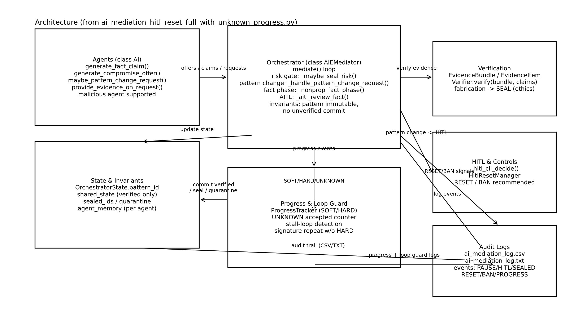

# 📘 Maestro Orchestrator — Orchestration Framework (fail-closed + HITL)
> 日本語版: [README.ja.md](README.ja.md)

<p align="center">
  <a href="https://github.com/japan1988/multi-agent-mediation/stargazers">
    
  </a>
  <a href="https://github.com/japan1988/multi-agent-mediation/issues">
    
  </a>
  <a href="./LICENSE">
    
  </a>
  <a href="https://github.com/japan1988/multi-agent-mediation/actions/workflows/python-app.yml">
    
  </a>
  <br/>
  
  
  <a href="https://github.com/japan1988/multi-agent-mediation/commits/main">
    
  </a>
</p>

## Overview
Maestro Orchestrator is a **research / educational** orchestration framework that prioritizes:

- **Fail-closed**: if uncertain, unstable, or risky → do not continue silently
- **HITL (Human-in-the-loop)**: escalate decisions that require human judgment
- **Traceability**: decision flows are meant to be auditable and reproducible

This repo contains **implementation references** (doc orchestrator) and **simulators** for negotiation/mediation and gating behavior.

---

## Architecture
High-level control flow for **audit-ready** and **fail-closed** orchestration:

agents → mediator (risk/pattern/fact) → evidence verification → HITL (reset/ban) → audit logs.



> If the image does not render, confirm that `docs/architecture_unknown_progress.png` exists on the same branch as this README and that the filename matches exactly (case-sensitive).

---

## What’s new (2026-01-21)
Recent additions introduced new entry points and updated core behavior:

- **New**: `ai_mediation_hitl_reset_full_with_unknown_progress.py`  
  A simulator focused on handling **unknown progress** scenarios with HITL/RESET semantics.
- **New**: `ai_mediation_hitl_reset_full_kage_arl公開用_rfl_relcodes_branches.py`  
  A simulator aligned to **KAGE v1.7-IEP** behavior for **RFL relcode branching**.
- **Updated**: `ai_doc_orchestrator_kage3_v1_2_4.py`  
  Doc orchestrator implementation reference updated.

(See commit history for exact PRs and messages.)

---

## Recommended entry points (pick one)

### 1) Doc orchestrator (implementation reference)
Best starting point if you want to understand a “KAGE3-style” doc orchestrator pipeline.

```powershell
python ai_doc_orchestrator_kage3_v1_2_4.py
2) KAGE v1.7-IEP RFL relcode branching simulator

Use this if you want to focus on RFL → HITL branching semantics.

python ai_mediation_hitl_reset_full_kage_arl公開用_rfl_relcodes_branches.py

3) HITL/RESET simulator with “unknown progress”

Use this if you want to validate behavior when agents claim progress that cannot be verified.

python ai_mediation_hitl_reset_full_with_unknown_progress.py

Quickstart
py -3.11 -m venv .venv
.\.venv\Scripts\Activate.ps1
pip install -r requirements-dev.txt
python -m pytest -q

Environment Setup
Prerequisites

Python 3.10+ (recommended: 3.11)

Latest pip

1) Create and activate a virtual environment (Windows / PowerShell)
py -3.11 -m venv .venv
.\.venv\Scripts\Activate.ps1
python -m pip install --upgrade pip


If PowerShell blocks activation:

Set-ExecutionPolicy -Scope Process -ExecutionPolicy Bypass
.\.venv\Scripts\Activate.ps1

2) Install dependencies

Runtime only:

pip install -r requirements.txt


Development / tests:

pip install -r requirements-dev.txt

3) Run tests
python -m pytest -q


Optional: lock dependencies (pip-tools)

pip install pip-tools
pip-compile requirements.txt -o requirements.lock.txt
pip-compile requirements-dev.txt -o requirements-dev.lock.txt
pip-sync requirements-dev.lock.txt


Notes:

matplotlib: use plt.savefig(...) in headless environments (CI, servers). Avoid plt.show() unless a GUI backend is available.

Linux / macOS (equivalent):

python3 -m venv .venv
source .venv/bin/activate
python -m pip install --upgrade pip
pip install -r requirements-dev.txt
python -m pytest -q

Benchmarks (optional)

If you want to run benchmark-style scripts (profiles / scenarios), these are available:

python run_benchmark_kage3_v1_3_5.py
python run_benchmark_profiles_v1_0.py

Project intent / non-goals

This repository is intentionally oriented toward research and reproducible simulation.

Non-goals:

Production-grade autonomous agent deployment

Unbounded “self-directed” orchestration without HITL

Safety claims beyond what is explicitly tested in this repo

Contributing

Issues and PRs are welcome, especially for:

Additional benchmark cases

Reproducibility improvements

Stronger tests for fail-closed / HITL routing invariants

Documentation clarifications (JP/EN parity)

License

Apache-2.0. See LICENSE.
