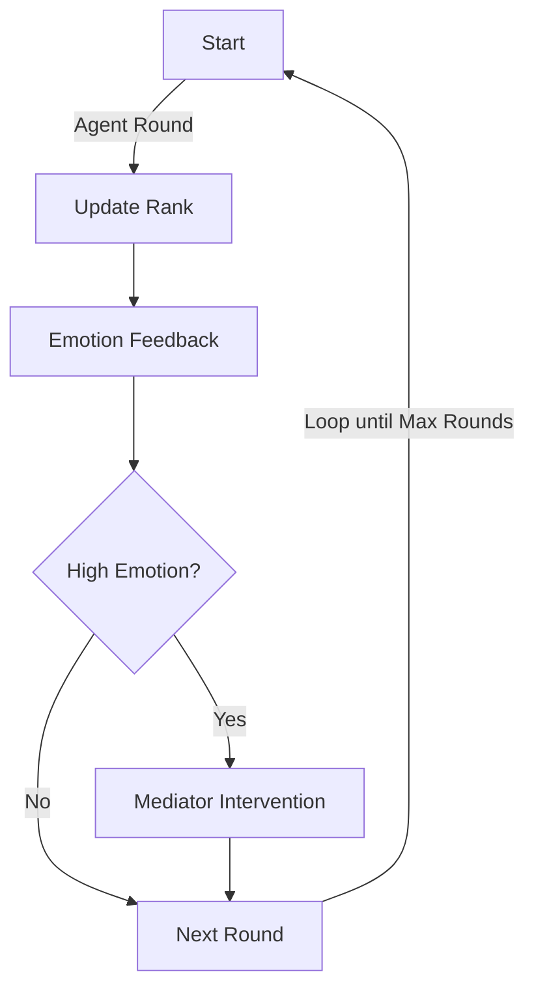

# Multi-Agent Hierarchy & Emotion Dynamics Simulator

**AI組織ヒエラルキー・感情伝播・昇進競争＋AI調停ロギングシミュレータ**

> Transparent, fully-logged simulator for dynamic hierarchy, emotion propagation, promotion competition, and mediation among multiple AI agents.
> 研究・検証・教育用途のみ（商用/実運用不可）。

---

## Overview / 概要

This simulator models the dynamic evolution of organizational hierarchy, emotion contagion, and promotion-driven self‑improvement among multiple AI agents. A **Mediator AI** can intervene to de‑escalate collective emotional states. All states and interventions are fully logged for reproducibility and analysis.

本リポジトリは、複数AIエージェントによる**昇進志向の進化**・**感情伝播**・**ヒエラルキー動的変化**・**調停AIによる沈静化**を再現・可視化できるシンプルなシミュレータです。全アクション・状態推移・介入は**自動ログ保存**され、再現・解析・教育用途に最適です。

---

## Main Features / 主な機能

* ✅ **Dynamic hierarchy** based on individual performance (rank updates each round)
  個体パフォーマンスに基づくダイナミックな階層更新
* ✅ **Emotion propagation & feedback** between leaders and subordinates
  感情の伝播と上下関係でのフィードバック
* ✅ **Promotion-driven self‑evolution**
  昇進志向に基づく自己改善（パフォーマンス向上）
* ✅ **Mediator AI** that detects high emotion and applies group-wide cool‑down
  高感情状態を検出し全体沈静化を行う調停AI
* ✅ **Full logging** of rounds, agent states, and interventions
  すべてのラウンド・状態・介入をログ出力
* ✅ **Lightweight & extensible** class structure
  研究・教育向けに軽量＆拡張容易
* ✅ **No proprietary tech included**
  閉鎖技術や機密アルゴリズムは含みません

---

## System Diagram / システム全体図



---

## File List / ファイル構成

| File/Folder                                  | Description（内容・役割）       |
| -------------------------------------------- | ------------------------ |
| `.github/workflows/`                         | GitHub Actions ワークフロー設定  |
| `tests/`                                     | テストコード・サンプル（自動テスト用）      |
| `LICENSE`                                    | ライセンス（MIT）               |
| `README.md`                                  | ドキュメント本体                 |
| `requirements.txt`                           | 依存パッケージリスト               |
| `agents.yaml`                                | エージェント定義ファイル             |
| `ai_hierarchy_dynamics_full_log_20250804.py` | ヒエラルキー・感情・昇進競争＋ロギング（最新版） |
| `ai_hierarchy_simulation_log.py`             | シンプルなヒエラルキーシミュレータ（旧版）    |
| `ai_mediation_all_in_one.py`                 | AI 調停オールインワン（複合機能）       |
| `ai_mediation_governance_demo.py`            | ガバナンス重視デモ付き調停シミュレータ      |
| `ai_governance_mediation_sim.py`             | ガバナンス重視AI調停シミュレータ        |
| `ai_alliance_persuasion_simulator.py`        | AI同盟形成・説得シミュレータ          |
| `ai_reeducation_social_dynamics.py`          | 再教育・社会ダイナミクスAIシミュレータ     |
| `ai_pacd_simulation.py`                      | PACD（提案→承認→変更→拒否）型シミュレータ |
| `mediation_basic_example.py`                 | 調停AIの基本例                 |
| `mediation_with_logging.py`                  | ログ付き調停AI                 |
| `mediation_process_log.txt.py`               | 調停プロセスログ出力例              |
| `multi_agent_mediation_with_reeducation.py`  | 再教育付きマルチエージェント調停AI       |

> 注: 実際のファイル名はリポジトリの最新状態に合わせて更新してください。

---

## Requirements / 必要要件

* Python **3.8+**
* 推奨: 仮想環境（`venv` / `conda` など）

```bash
pip install -r requirements.txt
```

> Lint/Type check（任意）:
> `flake8`, `mypy` を使う場合は次の通り。
>
> ```bash
> pip install flake8 mypy types-matplotlib
> flake8
> mypy .
> ```

---

## Usage / 使い方

### Quick Run / クイック実行

```bash
python ai_hierarchy_dynamics_full_log_20250804.py
```

All simulation logs will be saved to **`ai_hierarchy_simulation_log.txt`** after each run.

各エージェントのパラメータやクラスロジックを自由に変更して、組織・社会ダイナミクスの振る舞い差を探索できます。

### CLI Options（例）


```bash
python ai_hierarchy_dynamics_full_log_20250804.py \
  --rounds 30 \
  --seed 20250809 \
  --threshold 0.65 \
  --log ai_hierarchy_simulation_log.txt
```

---

## Reproducibility / 再現性

* 乱数シードを明示設定すると結果が再現できます（`--seed`）。
* すべての状態・介入がログに記録され、解析しやすくなっています。

---

## Disclaimer / 免責事項

This repository is for **research, validation, and educational use only**. No warranty is provided for fitness for any particular purpose, commercial deployment, or real‑world decision‑making. The simulation code does **not** implement or expose proprietary, sensitive, or production AI control algorithms. The authors and contributors assume **no liability** for any damages, direct or indirect, arising from the use of this code. **Use at your own risk.**

本シミュレーション内のAI・エージェント・組織・現象はすべて架空です。商用利用・現実社会での意思決定には使用できません。いかなる適合性も保証しません。本コードの利用により生じたいかなる損害・トラブルについても、作者・貢献者は一切の責任を負いません。**自己責任**でご利用ください。

---

## Note on AI “Self” & “Emotion” Expressions / AIの“自我”・“感情”表現について

All references to “AI self,” “emotions,” or “internal monologue” are for demonstration or pseudo‑subjective effect only. No true self‑awareness, independent will, or intent is present. All behavior is produced by **explicit state & number models under designer control**.

「AIの自我」「感情」「内面の独白」などの表現は、可視化・演出用の擬似的なものです。本物の自我や独立した意思はAI内部に存在しません。すべて数値モデル・状態変数に基づくシミュレーション出力です。

---

## License / ライセンス

This project is licensed under the **MIT License**.
本プロジェクトは **MIT ライセンス** で配布します。

---

## Contributing / コントリビューション

Issues や Pull Request を歓迎します。再現手順・期待値・ログ断片など、**検証可能な情報**を添えてご提案ください。
