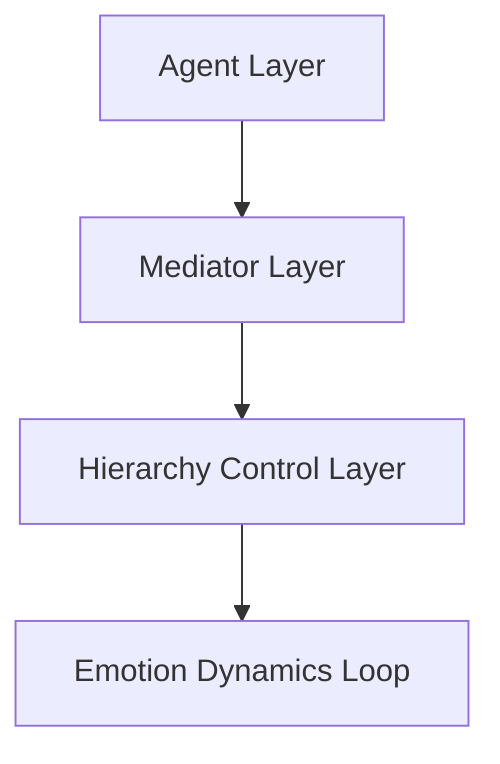

# 🧩 Sharp Puzzle: Multi-Agent Hierarchy & Emotion Dynamics Simulator

多層エージェントの感情変化と調停過程を可視化・分析するための研究／教育向けシミュレーションフレームワークです。

---

## 🇯🇵 概要 (Overview – Japanese)

**Sharp Puzzle** は、階層構造をもつ複数のAIエージェントが、感情や意図を変化させながら「対立 → 調停 → 合意」に至るプロセスを**再現・観察・分析**するためのプロジェクトです。

> Sharp = 鋭い論理的思考、Puzzle = 感情と合理のはざまを解く知的課題。

感情や意思決定の階層構造をモデル化し、AI同士の社会的相互作用を理解・可視化することを目的としています。

---

## 🇬🇧 Overview (English)

**Sharp Puzzle** is a simulation framework designed to visualize and analyze how multiple agents in a hierarchical system adjust their emotions and intentions to resolve conflicts and reach harmony through mediation.

> “Sharp” stands for logical reasoning, and “Puzzle” represents the emotional and cognitive interplay that leads to equilibrium.

This project explores emotion-driven decision-making and social interaction among multi-layered AI agents.

---

## 📁 File Structure / ファイル構成

```
multi-agent-mediation/
├── README.md                       ← このドキュメント
├── requirements.txt                ← 依存パッケージ一覧
├── pyproject.toml (任意)           ← プロジェクト設定・ビルド情報
├── ai_mediation_all_in_one.py      ← メインシミュレーション実行スクリプト
├── ai_hierarchy_simulation_log.py  ← 階層シミュレーションログ記録
├── mediation_process_log.py        ← 調停過程のログ出力
├── tests/                          ← テストコード一式
│   └── test_emotion_dynamics.py
├── docs/                           ← ドキュメント・グラフ類
│   ├── graph_emotion_dynamics.png  ← 感情ダイナミクスのグラフ出力
│   └── generate_graph_emotion_dynamics.py ← グラフ自動生成スクリプト
├── .github/
│   └── workflows/                  ← CI／自動テスト設定
│       ├── ci.yml
│       └── codeql.yml
└── LICENSE                         ← MITライセンス
```

### 🧾 補足説明
- `ai_mediation_all_in_one.py` はプロジェクトのエントリーポイントであり、複数のモジュールを統合実行します。
- `mediation_process_log.py` は各シミュレーションの調停率や感情変化を時系列で出力します。
- `docs/` フォルダには実行結果の可視化用画像・ノート類を格納します。
- `.github/` 配下には継続的インテグレーション（CI）やセキュリティチェックを設定します。

---

## ⚙️ System Structure / システム構造



| Layer | 役割 / Role |
|--------|-------------|
| **Agent Layer** | 個々の感情・意図を持ち行動する層。Each agent acts based on its own emotional state. |
| **Mediator Layer** | 対立を調整し、調停を行う層。Handles negotiation and mediation. |
| **Hierarchy Control Layer** | 全体バランス・安定性を制御する層。Maintains global balance and adaptation. |
| **Emotion Dynamics Loop** | 感情変化を時系列で反映。Tracks emotional transitions over time. |

---

## 🔄 Simulation Flow / シミュレーションの流れ

1. 初期状態のエージェント群を生成。
2. 感情・意図が相互に影響し、対立が発生。
3. Mediatorが介入し、調停プロセスを実行。
4. 感情値・調停率をログとして出力し、グラフ化。

---

## 📊 Emotion Dynamics Graph Example / 感情ダイナミクス例


上図は各エージェントの感情が時間とともに収束し、調停成功へ向かう過程を示しています。

The above graph shows how agents' emotions converge toward equilibrium as mediation progresses.

---

## 🧠 Applications / 応用例

- 感情を持つAIエージェントの相互作用研究 (Research on emotion-aware agents)
- 教育教材：感情と論理の統合シミュレーション (Educational use)
- 対話AIの共感・衝突・妥協プロセスの再現 (Dialogue AI studies)
- 社会システムや組織内調停のモデリング (Social/organizational mediation models)

---

## 🚀 Quick Start / 実行方法

```bash
git clone https://github.com/japan1988/multi-agent-mediation
cd multi-agent-mediation
python ai_mediation_all_in_one.py
```

出力: `logs/` 内に各シミュレーションログが生成されます。

Output files (in `logs/`) contain emotional values and mediation progress over time.

---

## 🧩 Name Breakdown / 名前の意味

| Term | Meaning |
|------|----------|
| **Sharp** | 鋭い論理的思考を象徴 (Symbol of logical reasoning) |
| **Puzzle** | 感情と合理を解く知的課題 (Intellectual challenge of emotion-logic balance) |
| **Multi-Agent** | 多主体の相互作用を表現 (Multiple interacting agents) |
| **Hierarchy** | 階層構造・統制機構 (Hierarchical control) |
| **Emotion Dynamics** | 感情変化と時間的学習 (Temporal emotional transitions) |
| **Simu** | Simulationの略称 (Abbrev. of Simulation) |

---

## 🧩 Future Work / 今後の展望

- [ ] グラフ自動生成の強化 (Enhanced auto-graph generation)
- [ ] 感情モデルをYAML定義化 (Configurable emotion models)
- [ ] Webデモ化 (Streamlit web visualization)
- [ ] データ分析Notebookの追加 (Jupyter notebook for analysis)

---

## 📈 Graph Generation Script (docs/graph_emotion_dynamics.png)

```python
# docs/generate_graph_emotion_dynamics.py
import matplotlib.pyplot as plt
import os

time = list(range(10))
anger = [0.2,0.3,0.4,0.6,0.5,0.3,0.2,0.1,0.05,0.05]
empathy = [0.1,0.2,0.4,0.5,0.6,0.7,0.7,0.6,0.4,0.3]

plt.figure(figsize=(6,4))
plt.plot(time, anger, label="Anger", linewidth=2)
plt.plot(time, empathy, label="Empathy", linewidth=2)
plt.xlabel("Simulation Step")
plt.ylabel("Emotion Level")
plt.title("Emotion Dynamics Over Time")
plt.legend()
os.makedirs("docs", exist_ok=True)
plt.savefig("docs/graph_emotion_dynamics.png", dpi=200, bbox_inches="tight")
plt.close()
print("✅ Saved docs/graph_emotion_dynamics.png")
```

---

## ⚠️ 免責事項 / Disclaimer

本リポジトリの内容は、**学術研究・教育・非営利目的の利用**を前提として設計されています。  
商用利用、第三者への助言行為、医療・心理・軍事関連など**人間の意思決定に直接影響を及ぼす分野での利用は想定されていません**。

- 本プロジェクトは「感情」や「調停」を**アルゴリズム的に模倣**したものであり、実際の人間の感情・倫理・心理的状態を保証するものではありません。  
- 開発者は、利用によって生じたいかなる損害・誤解・二次的影響についても責任を負いません。  
- 教育・研究目的での再利用・派生は自由ですが、ライセンス（MIT）の条件を遵守してください。

> 本プロジェクトの理念：**AIは手段であり、目的ではない。**  
> 感情と論理のバランスを探る知的パズルとして、本リポジトリをお使いください。

---

> 🧩 **Sharp Puzzle** — Where logic meets emotion, and balance becomes visible.
