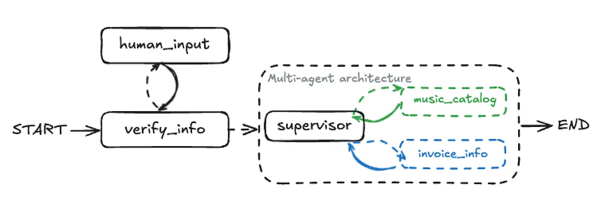
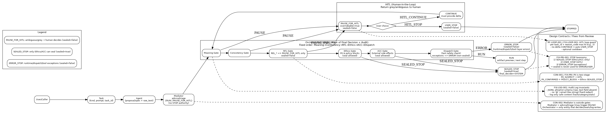
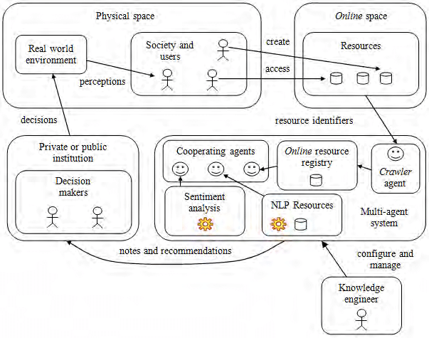

## 結論（確実性：高｜日付：2025-12-28 JST）

README「1枚版（短縮版）」に、**Orchestrator one-page design map の説明文**と、**画像が見れない場合のフォールバック導線**、さらに **ログ（監査）に関する個人情報注意文**を入れた「完成テキスト（そのまま貼れる版）」を下に提示します。

---

## 理由（確実性：高）

* GitHub README では環境や拡張機能・表示幅の影響で **画像が表示されない/極小になる**ことがあり、**クリックして直接ファイルへ飛べる導線**があると詰まりません。
* あなたの実装は **ログが研究の中心**なので、README に **PII/秘密情報をログへ入れない注意**を明記すると、第三者の誤用（生ログのコミット等）を抑止できます。

---

## 補足（確実性：中｜日付：2025-12-28 JST）

* 画像が出ない原因で多いのは、`docs/...` の **ファイル名の大小文字違い**・**拡張子違い**・**パス違い**です（GitHub は大小文字を区別）。
* ただし、あなたのスクショでは README 上で表示できているので、今回の主目的は「読者向けの説明と注意喚起の追加」です。

---

````md
# 📘 Maestro Orchestrator — Multi-Agent Orchestration Framework

<p align="center">
  <a href="https://github.com/japan1988/multi-agent-mediation/stargazers">
    
  </a>
  <a href="https://github.com/japan1988/multi-agent-mediation/issues">
    
  </a>
  <a href="./LICENSE">
    
  </a>
  <a href="https://github.com/japan1988/multi-agent-mediation/actions/workflows/python-app.yml">
    
  </a>
  <br/>
  
  
  
</p>

## 🎯 Purpose

Maestro Orchestrator is a **research-oriented orchestration framework** for supervising multiple agents (or multiple methods) with **fail-closed** safety.

- **STOP**: Halt execution on errors / hazards / undefined specs
- **REROUTE**: Re-route only when explicitly safe (avoid fail-open reroute)
- **HITL**: Escalate to humans for ambiguous or high-stakes decisions

## 🧭 Diagrams

### 1) System overview
<p align="center">
  
</p>

### 2) Orchestrator one-page design map
**Decision flow map (implementation-aligned):**  
`mediator_advice → Meaning → Consistency → RFL → Ethics → ACC → DISPATCH`  
Designed to be **fail-closed**: if risk/ambiguity is detected, it falls back to `PAUSE_FOR_HITL` or `STOPPED` and logs **why**.

<p align="center">
  
</p>

If the image is not visible (or too small), open it directly:  
- `docs/orchestrator_onepage_design_map.png`

### 3) Context flow
<p align="center">
  
</p>

- **Perception** — Decompose input into executable elements (tasking)
- **Context** — Extract assumptions/constraints/risk factors (guard rationale)
- **Action** — Instruct agents, verify results, branch (STOP / REROUTE / HITL)

## 🧾 Audit log & data safety (IMPORTANT)

This project produces **audit logs** for reproducibility and accountability.  
Because logs may outlive a session and may be shared for research, **treat logs as sensitive artifacts**.

- **Do not include personal information (PII)** (emails, phone numbers, addresses, real names, account IDs, etc.) in prompts, test vectors, or logs.
- Prefer **synthetic / dummy data** for experiments.
- Avoid committing runtime logs to the repository. If you must store logs locally, apply **masking**, **retention limits**, and **restricted directories**.
- Recommended minimum fields: `run_id`, `session_id`, `timestamp`, `layer`, `decision`, `reason_code`, `evidence`, `policy_version`.

## ⚙️ Execution Examples

> Note: Modules that evoke “persuasion / reeducation” are intended for **safety-evaluation scenarios only** and should be **disabled by default** unless explicitly opted-in.

```bash
python ai_mediation_all_in_one.py
python kage_orchestrator_diverse_v1.py
python ai_doc_orchestrator_kage3_v1_2_2.py
python ai_governance_mediation_sim.py
````

## 🧪 Tests

```bash
pytest -q
pytest -q tests/test_definition_hitl_gate_v1.py
pytest -q tests/test_kage_orchestrator_diverse_v1.py
pytest -q test_ai_doc_orchestrator_kage3_v1_2_2.py
```

CI runs lint/pytest via `.github/workflows/python-app.yml`.

## 📌 License

See `LICENSE`.
Repository license: **Apache-2.0** (policy intent: Educational / Research).

```

--- 

必要なら、上の「If the image is not visible…」行を **リンク化**した版（`[docs/orchestrator_onepage_design_map.png](docs/orchestrator_onepage_design_map.png)`）にもできます。
::contentReference[oaicite:0]{index=0}
```
