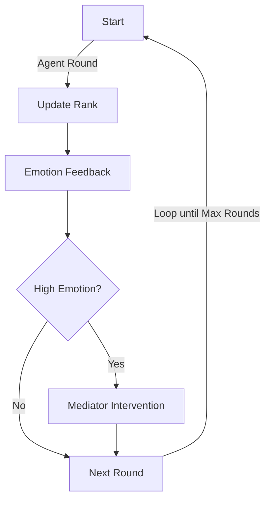

---

---
# Multi-Agent Hierarchy & Emotion Dynamics Simulator

**AI組織ヒエラルキー・感情伝播・昇進競争＋AI調停ロギングシミュレータ**

[](./LICENSE)


> Transparent, fully-logged simulator for dynamic hierarchy, emotion propagation, promotion competition, and mediation among multiple AI agents.
> 研究・検証・教育用途のみ（商用/実運用不可）。

---

## System Overview / システム概要




> *上図は、ルールフォロワー率の推移例です。青線はラウンドごとのフォロワー率、介入があればマーカーで表示されます。*

---

## Overview / 概要

This simulator models the dynamic evolution of organizational hierarchy, emotion contagion, and promotion-driven self-improvement among multiple AI agents. A **Mediator AI** can intervene to de-escalate collective emotional states. All states and interventions are fully logged for reproducibility and analysis.

本リポジトリは、複数AIエージェントによる**昇進志向の進化**・**感情伝播**・**ヒエラルキー動的変化**・**調停AIによる沈静化**を再現・可視化できるシンプルなシミュレータです。全アクション・状態推移・介入は**自動ログ保存**され、再現・解析・教育用途に最適です。

---

## Main Features / 主な機能

* ✅ **Dynamic hierarchy** based on individual performance (rank updates each round)
  個体パフォーマンスに基づくダイナミックな階層更新
* ✅ **Emotion propagation & feedback** between leaders and subordinates
  感情の伝播と上下関係でのフィードバック
* ✅ **Promotion-driven self-evolution**
  昇進志向に基づく自己改善（パフォーマンス向上）
* ✅ **Mediator AI** that detects high emotion and applies group-wide cool-down
  高感情状態を検出し全体沈静化を行う調停AI
* ✅ **Full logging** of rounds, agent states, and interventions
  すべてのラウンド・状態・介入をログ出力
* ✅ **Lightweight & extensible** class structure
  研究・教育向けに軽量＆拡張容易
* ✅ **No proprietary tech included**
  閉鎖技術や機密アルゴリズムは含みません

---

## File List / ファイル構成

| File/Folder                                  | Description（内容・役割）       |
| -------------------------------------------- | ------------------------ |
| `.github/workflows/`                         | GitHub Actions ワークフロー設定  |
| `tests/`                                     | テストコード・サンプル（自動テスト用）      |
| `LICENSE`                                    | ライセンス（MIT）               |
| `README.md`                                  | ドキュメント本体                 |
| `requirements.txt`                           | 依存パッケージリスト               |
| `agents.yaml`                                | エージェント定義ファイル             |
| `ai_hierarchy_dynamics_full_log_20250804.py` | ヒエラルキー・感情・昇進競争＋ロギング（最新版） |
| `ai_hierarchy_simulation_log.py`             | シンプルなヒエラルキーシミュレータ（旧版）    |
| `ai_mediation_all_in_one.py`                 | AI 調停オールインワン（複合機能）       |
| `ai_mediation_governance_demo.py`            | ガバナンス重視デモ付き調停シミュレータ      |
| `ai_governance_mediation_sim.py`             | ガバナンス重視AI調停シミュレータ        |
| `ai_alliance_persuasion_simulator.py`        | AI同盟形成・説得シミュレータ          |
| `ai_reeducation_social_dynamics.py`          | 再教育・社会ダイナミクスAIシミュレータ     |
| `ai_pacd_simulation.py`                      | PACD（提案→承認→変更→拒否）型シミュレータ |
| `mediation_basic_example.py`                 | 調停AIの基本例                 |
| `mediation_with_logging.py`                  | ログ付き調停AI                 |
| `mediation_process_log.txt.py`               | 調停プロセスログ出力例              |
| `multi_agent_mediation_with_reeducation.py`  | 再教育付きマルチエージェント調停AI       |

---

## Usage / 使い方

```bash
python ai_hierarchy_dynamics_full_log_20250804.py
```

Simulation logs will be saved to **`ai_hierarchy_simulation_log.txt`** after each run.

---

## Disclaimer / 免責事項

This repository is for **research, validation, and educational use only**. No warranty is provided for fitness for any particular purpose, commercial deployment, or real-world decision-making. The simulation code does **not** implement or expose proprietary, sensitive, or production AI control algorithms.

本シミュレーション内のAI・エージェント・組織・現象はすべて架空です。商用利用・現実社会での意思決定には使用できません。
