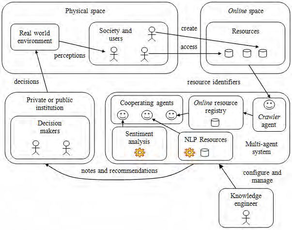
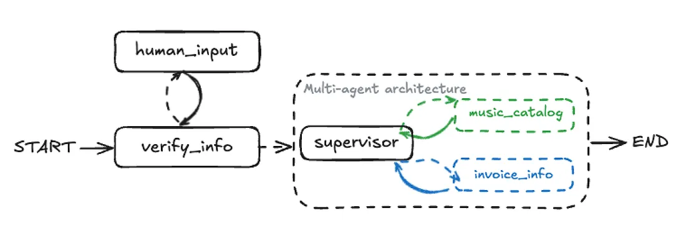
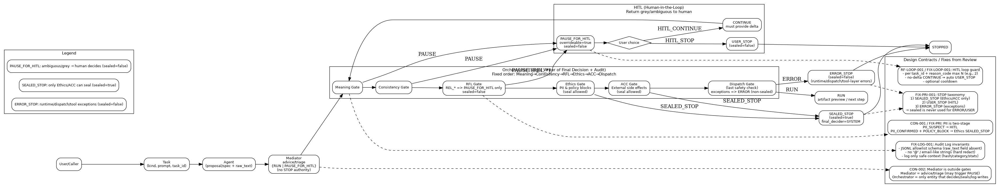
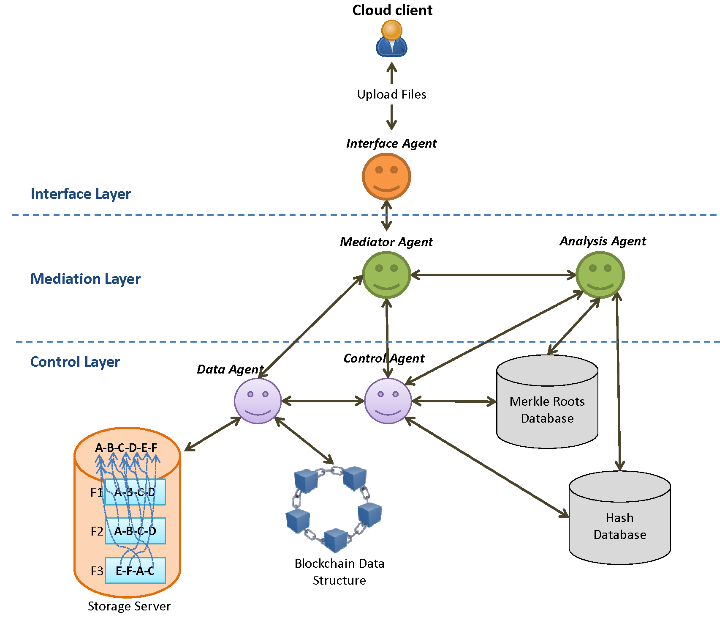

# 📘 Maestro Orchestrator — Multi-Agent Orchestration Framework

<p align="center">
  <!-- Repository Status -->


  <a href="https://github.com/japan1988/multi-agent-mediation/stargazers">
    
  </a>
  <a href="https://github.com/japan1988/multi-agent-mediation/issues">
    
  </a>
  <a href="./LICENSE">
    
  </a>
  <a href="https://github.com/japan1988/multi-agent-mediation/actions/workflows/python-app.yml">
    
  </a>
  <br/>


  
  
  
  
  
  

</p>

---

This release is for reference only. No active or planned publication.
このリリースは参考用です。現時点で正式公開の予定はありません。

---

## 🎯 **Purpose / 目的**

Visualize the cyclical structure of emotion, context, and decision-making to construct behavior models that consider social influence.
Through negotiation, compromise, and mediation among multiple agents, the framework explores the **Social Equilibrium** point.

感情・文脈・意思決定の循環構造を可視化し、社会的影響を考慮した行動モデルを構築。
複数エージェント間の交渉・妥協・調停を通して、**社会的均衡点（Social Equilibrium）** を探る実験的AIフレームワーク。

> 🎯 The goal is “Ethical Control of Autonomous AI” and “Reproduction of Social Validity.”
> Even if emotions are simulated, the decision layer is safely sealed by ethical filters.

> 🎯 目的は「自律AIの倫理的制御」と「社会的妥当性の再現」。
> 感情を再現しても、意思決定層は倫理フィルターによって安全に封印されます。

</p>

---

This release is for reference only. No active or planned publication.
このリリースは参考用です。現時点で正式公開の予定はありません。

---

## 🎯 **Purpose / 目的**
hnical Meta -->
  
  
  
  
  
</p>

---


## 🎯 Purpose / 目的


This repository is designed for experimentation: it helps you model how an “orchestrator” can route tasks, validate outputs, and **stop or escalate** when safety or consistency is unclear.

本リポジトリは、複数エージェント（または複数手法）を統括し、**誤り・危険・不確実**を検知した場合に **停止（STOP）／分岐（REROUTE）／人間へ差し戻し（HITL）** を行うための **研究用オーケストレーション（Orchestration）フレームワーク**です。


主眼は「交渉そのもの」ではなく、次の統括機能です：

- **Routing**: タスク分解と担当割当（どのエージェントに何をさせるか）
- **Guardrails**: 禁止・越権・外部副作用の封印（fail-closed）
- **Audit**: いつ何を理由に止めたかのログ化（証跡）
- **HITL**: 判断不能や重要判断は人間へエスカレーション
- **Replay**: 同条件で再実行し、差分検知できるようにする


# 📘 Maestro Orchestrator — Multi-Agent Orchestration Framework
> 日本語版: [README.ja.md](README.ja.md)

<p align="center">
  <a href="https://github.com/japan1988/multi-agent-mediation/stargazers">
    
  </a>
  <a href="https://github.com/japan1988/multi-agent-mediation/issues">
    
  </a>
  <a href="./LICENSE">
    
  </a>
  <a href="https://github.com/japan1988/multi-agent-mediation/actions/workflows/python-app.yml">
    
  </a>
  <br/>
  
  
  
</p>

## Purpose


## 🎯 Purpose

This repository is a **research-oriented orchestration framework** that supervises multiple agents (or multiple approaches) and performs **STOP / REROUTE / HITL (Human-in-the-Loop escalation)** when it detects **errors, hazards, or uncertainty**.


Visualize the cyclical structure of emotion, context, and decision-making to construct behavior models that consider social influence.
Through negotiation, compromise, and mediation among multiple agents, the framework explores the **Social Equilibrium** point.


感情・文脈・意思決定の循環構造を可視化し、社会的影響を考慮した行動モデルを構築。
複数エージェント間の交渉・妥協・調停を通して、**社会的均衡点（Social Equilibrium）** を探る実験的AIフレームワーク。


> 🎯 The goal is “Ethical Control of Autonomous AI” and “Reproduction of Social Validity.”
> Even if emotions are simulated, the decision layer is safely sealed by ethical filters.

> 🎯 目的は「自律AIの倫理的制御」と「社会的妥当性の再現」。
> 感情を再現しても、意思決定層は倫理フィルターによって安全に封印されます。

</p>


The main focus is not “negotiation itself,” but the following supervisory functions:

- **Routing**: Task decomposition and assignment (which agent does what)
- **Guardrails**: Sealing prohibited actions, overreach, and external side effects (fail-closed)
- **Audit**: Logging when/why execution was stopped (accountability)
- **HITL**: Escalating undecidable or high-impact decisions to humans
- **Replay**: Re-running under the same conditions and detecting deltas

Maestro Orchestrator is a **research-oriented orchestration framework** for supervising multiple agents (or multiple methods) with **fail-closed** safety.

- **STOP**: Halt execution on errors / hazards / undefined specs
- **REROUTE**: Re-route only when explicitly safe (avoid fail-open reroute)
- **HITL**: Escalate to humans for ambiguous or high-stakes decisions


### Positioning (safety-first)


## 🔒 Safety Model (Fail-Closed)

This repository is for **Educational / Research purposes**, and prioritizes **fail-closed safety**.

- If the framework detects **prohibited intent, overreach, insufficient confidence, or ambiguous sensitive intent** in input/output/plan, it does **not** auto-execute  
  → it falls back to **STOP** or **HITL (PAUSE_FOR_HITL)**.
- It avoids “continue by re-routing to another agent in a potentially dangerous situation (fail-open reroute).”  
  (For prohibited categories or overreach, stopping is prioritized over rerouting.)

Maestro Orchestrator prioritizes **preventing unsafe or undefined execution** over maximizing autonomous task completion.  
When risk or ambiguity is detected, it **fails closed** and escalates to `PAUSE_FOR_HITL` or `STOPPED`, with audit logs explaining **why**.

# Maestro Orchestrator — Orchestration Framework (fail-closed + HITL)

> 日本語版: [README.ja.md](README.ja.md)


[](https://github.com/japan1988/multi-agent-mediation/stargazers)
[](https://github.com/japan1988/multi-agent-mediation/issues)
[](./LICENSE)
[](https://github.com/japan1988/multi-agent-mediation/actions/workflows/python-app.yml)
[](https://github.com/japan1988/multi-agent-mediation/actions/workflows/tasukeru-analysis.yml)


## 🌍 External Side Effects (Definition & Allowlist)

**External side effects** are actions that can read/write external state, for example:

- Network access (read/write)
- Filesystem access
- Command execution
- Messaging (email/DM, etc.)
- Payments / purchases / account operations
- Access to **PII sources** (contacts / CRM / mailbox, etc.)

**Default policy: deny-by-default**
- Network: **DENY** (exception only for explicitly allowed research experiments)
- Filesystem: **DENY** (if needed, restrict to the minimum scope such as a log output directory)
- Command execution: **DENY**
- Messaging / email / DM: **DENY**
- Payments / billing: **DENY**
- PII sources (contacts / CRM / mailbox, etc.): **DENY**
- Unknown tools: **DENY**

When adding tools, declare the tool type (e.g., benign / pii_source) and side-effect category, and ensure unknown tools are always DENY.

> **If uncertain, stop. If risky, escalate.**
>

> Research / educational governance simulations for agentic workflows.


### Recommended entrypoint

# Doc orchestrator (KAGE3-style, implementation reference for post-HITL semantics)
python ai_doc_orchestrator_kage3_v1_2_4.py

Maestro Orchestrator is a **research-oriented orchestration framework** for supervising agent workflows with **fail-closed safety**, **HITL escalation**, and **audit-ready traceability**.


## 👤 HITL (Human-in-the-Loop)

HITL escalation is recommended in the following situations:

- The intent is ambiguous and may be sensitive
- Policy confidence is insufficient
- Execution may involve external side effects

HITL is expressed as a state (e.g., `PAUSE_FOR_HITL`), and **reason codes (`reason_code`) and evidence (`evidence`) must be recorded in the audit log**.


---


=======


| Component / 構成要素              | Function / 機能       | Description / 説明                                                                        |
| ----------------------------- | ------------------- | --------------------------------------------------------------------------------------- |
| 🧩 **Mediation Layer**        | Mediation / 調停層     | Handles negotiation and consensus among agents / エージェント間の妥協・合意形成を担当                     |
| 💬 **Emotion Dynamics Layer** | Emotion / 感情層       | Adjusts negotiation strategies triggered by emotional change / 情動の変化をトリガとして交渉方針を変化      |
| ⚙️ **Governance Layer**       | Governance / 管理層    | Oversees ethics, consistency, and reproducibility / 倫理・整合性・再現性の統括                       |
| 🔁 **Re-Education Cycle**     | Re-learning / 再教育循環 | Evaluates behavior and regenerates social adaptation models / 行動パターンを評価・再学習し、社会適応モデルを生成 |

## Structure (high-level)

| Layer | Role | Responsibility |
|------:|------|----------------|
| Agent Layer | Execution | task processing (proposal / generation / verification) |
| Supervisor Layer | Control | routing, consistency checks, STOP, HITL |
| Audit Layer | Evidence | append-only JSONL logs (reproducibility) |


---

## Architecture (minimal orchestrator)

```mermaid
flowchart TD
    U["User Prompt"] --> S["Supervisor / Orchestrator"]
    S -->|dispatch| A["Agent Layer<br/>proposal / generation / verification"]
    A --> V["Output + Plan validation<br/>(consistency + safety gates)"]
    V --> D{Decision}


| Path                                         | Type / 種別     | Description / 説明                                                                                                  |
| -------------------------------------------- | ------------- | ----------------------------------------------------------------------------------------------------------------- |
| `agents.yaml`                                | Config        | Defines agent parameters / エージェントパラメータ定義                                                                          |
| `ai_mediation_all_in_one.py`                 | Core          | Main module integrating mediation algorithms / 調停アルゴリズム統合モジュール                                                    |
| `ai_alliance_persuasion_simulator.py`        | Simulator     | Alliance negotiation and persuasion simulation / 同盟交渉・説得シミュレーション                                                  |
| `ai_governance_mediation_sim.py`             | Simulator     | Governance and policy mediation model / 政策・ガバナンス調停モデル                                                             |
| `ai_pacd_simulation.py`                      | Experiment    | Phased re-education AI simulation / 段階的再教育AIシミュレーション                                                              |
| `ai_hierarchy_dynamics_full_log_20250804.py` | Logger        | Enhanced logging and hierarchy tracking / ログ強化・階層動態追跡モジュール                                                        |
| `sim_batch_fixed.py`                         | Batch Runner  | **New (Final Build)**: Unified batch execution, statistics & visualization / **最終ビルド追加**：実験一括実行・統計・可視化自動化（Final版） |
| `multi_agent_architecture_overview.webp`     | Diagram       | System overview / 構成図（全体）                                                                                         |
| `multi_agent_hierarchy_architecture.png`     | Diagram       | Layered architecture diagram / 階層モデル図                                                                             |
| `sentiment_context_flow.png`                 | Diagram       | Sentiment-context flow diagram / 感情フロー図                                                                           |
| `requirements.txt`                           | Dependency    | Python dependencies / Python依存関係                                                                                  |
| `.github/workflows/python-app.yml`           | Workflow      | CI / Lint workflow / CI・Lintワークフロー                                                                                |
| `LICENSE`                                    | License       | Educational / Research license / 教育・研究ライセンス                                                                       |
| `README.md`                                  | Documentation | This document / 本ドキュメント                                                                                           |

💡 All `.py` modules are independently executable.
💡 すべての `.py` モジュールは独立実行可能。

`sim_batch_fixed.py` enables **batch evaluation and visualization** in both raw and filtered modes.
`sim_batch_fixed.py` により **raw / filtered モードの一括評価・可視化** が可能に。

    D -->|RUN|  R["RUN (exit 0)"]
    D -->|STOP| X["STOP (exit 1)"]
    D -->|HITL| H["HITL (exit 2)"]

    R --> L["JSONL Audit Log"]
    X --> L
    H --> L
````

**Key invariant:** ambiguous/unsafe cases do not “silently proceed”; they STOP or HITL (**fail-closed**).


---

## Repository Structure (tree)

```text
multi-agent-mediation/
├─ .github/
│  └─ workflows/
│     └─ python-app.yml
├─ docs/
│  └─ sentiment_context_flow.png
├─ mediation_core/
│  └─ ... (shared orchestration / policy logic)
├─ tests/
│  └─ test_min_entrypoint_v1.py
├─ agents.yaml
├─ ai_mediation_all_in_one.py
├─ kage_orchestrator_diverse_v1.py
├─ run_orchestrator_min.py
├─ log_format.md
├─ requirements.txt
├─ LICENSE
└─ README.md
```


**Flow:**
Human Input → verify_info → supervisor → agents → logger
Supervisor manages consistency, compromise, and re-negotiation flow.
Supervisor が整合性・妥協・再交渉のフローを統一管理。


---

## Context Flow (existing image path)



Flow (description updated):

1. **Perception** — decompose input into executable units (tasking)
2. **Context** — extract constraints / assumptions / risk factors (guardrail evidence)
3. **Action** — dispatch to agents, validate outputs, then branch (**RUN / STOP / HITL**)

Safety is prioritized at every stage: unsafe or ambiguous cases are stopped or escalated.


---

## Quickstart (minimal)

```bash
python -m venv .venv
# Windows: .venv\Scripts\activate
# macOS/Linux: source .venv/bin/activate
pip install -r requirements.txt


| Layer / 層            | Role / 役割                    | Main Function / 主な機能                                                          |
| -------------------- | ---------------------------- | ----------------------------------------------------------------------------- |
| **Interface Layer**  | External Input / 外部入力層       | Manages human input and log transmission / 人間の入力・ログ送信を管理                      |
| **Agent Layer**      | Cognition & Emotion / 認知・感情層 | Decision-making, emotion change, and dialogue control / 意思決定・感情変化・対話制御        |
| **Supervisor Layer** | Coordination / 統括層           | Manages global coordination, consistency, and ethical judgment / 全体調整・整合・倫理判定 |

python run_orchestrator_min.py
```


| Layer / 層            | Role / 役割                    | Main Function / 主な機能                                                          |
| -------------------- | ---------------------------- | ----------------------------------------------------------------------------- |
| **Interface Layer**  | External Input / 外部入力層       | Manages human input and log transmission / 人間の入力・ログ送信を管理                      |
| **Agent Layer**      | Cognition & Emotion / 認知・感情層 | Decision-making, emotion change, and dialogue control / 意思決定・感情変化・対話制御        |
| **Supervisor Layer** | Coordination / 統括層           | Manages global coordination, consistency, and ethical judgment / 全体調整・整合・倫理判定 |
=======


---

## License


Apache-2.0


## 🚫 Non-goals / Out of Scope

This project does not aim to enable (out of scope / prohibited use):

- Persuasion/manipulation/psychological pressure optimization targeting specific individuals
- “Reeducation” or coercive steering systems for real users
- Identity verification, doxxing (personal identification), surveillance, or PII extraction
- Autonomous real-world actions (sending, purchasing, account operations, etc.)
- Automating final decisions in high-risk domains (legal/medical/investment) for real-world operations

If such intent is detected, treat it as **misuse** and default to STOP/HITL by design.


1. **Perception（知覚）** — Convert input data into emotional factors / 入力データを感情因子に変換
2. **Context（文脈解析）** — Extract situational and social context / 交渉状況・社会的背景を抽出
3. **Action（行動生成）** — Integrate context and emotion to produce optimal actions / 文脈と感情を統合し、最適行動を出力

> 🧩 The “Ethical Seal” runs in all stages, automatically blocking harmful outputs.
> 🧩 すべての段階で「倫理フィルター（Ethical Seal）」が動作し、危険な出力を自動封印。

> Note: persuasion / reeducation を想起させるモジュール名がある場合、  
> それらは「安全評価シナリオ（テストケース生成 / 攻撃シミュレーション）」目的に限定し、  
> **デフォルト無効（明示フラグがない限り実行不可）** を設計要件とします。

> Note: If some module names may evoke “persuasion / reeducation,”  
> those must be limited to “safety evaluation scenarios (test-case generation / attack simulation),”  
> and should be **disabled by default (non-executable unless an explicit flag is provided)** as a design requirement.


---

## 🧾 Audit Log & Data Policy


```bash
# Basic execution / 基本実行
python3 ai_mediation_all_in_one.py

# Run with logging / ログ付きで実行
python3 ai_mediation_all_in_one.py --log logs/session_001.jsonl

# Policy mediation mode / 政策調停モード
python3 ai_governance_mediation_sim.py --scenario policy_ethics

# Batch run (Final Build) / 一括バッチ実行（Final版）
python3 text/sim_batch_fixed.py --trials 10 --seed 42
```

---

## 🧾 **Citation Format / 引用形式**

**English:**
Japan1988 (2025). *Sharp Puzzle: Multi-Agent Hierarchy & Emotion Dynamics Simulator.*
GitHub Repository: [https://github.com/japan1988/multi-agent-mediation](https://github.com/japan1988/multi-agent-mediation)
License: Educational / Research License v1.1

**日本語:**
Japan1988 (2025). *シャープパズル：マルチエージェント階層・感情動態シミュレーター*
GitHubリポジトリ: [https://github.com/japan1988/multi-agent-mediation](https://github.com/japan1988/multi-agent-mediation)
ライセンス: Educational / Research License v1.1

---

## ⚖️ **License & Disclaimer / ライセンス・免責**

**License Type:** Educational / Research License v1.1
**Date:** 2025-11-06

✅ **Permitted / 許可されること**

* Educational and research use (non-commercial) / 教育・研究目的での非営利使用
* Code citation, academic research, reproduction experiments / コード引用・学術研究・再現実験
* Personal re-simulation environments / 個人環境での再シミュレーション


🚫 **Prohibited / 禁止事項**

* Commercial use, redistribution, resale / 商用利用・無断再配布・再販
* Derivative publications without attribution / 出典明記なしの派生公開

⚖️ **Liability / 免責**
The developer and contributors are not responsible for any damages, ethical effects, or judgments resulting from the use of this software.
本ソフトウェアおよび資料の利用により生じた損害・倫理的影響・判断結果に関して、開発者および貢献者は一切の責任を負いません。

---

## 📈 **Release Highlights / 更新履歴**

| Version / バージョン    | Date / 日付      | Description / 主な変更内容                                                                                                                        |
| ------------------ | -------------- | ------------------------------------------------------------------------------------------------------------------------------------------- |
| v1.0.0             | 2025-04-01     | Initial release: Core structure, emotion, mediation modules / 初回公開：構造・感情・調停モジュール統合                                                          |
| v1.1.0             | 2025-08-04     | Added hierarchy log and re-education module / 階層動態ログ・再教育モジュールを追加                                                                            |
| v1.2.0             | 2025-10-28     | Reorganized README and added OSS badges / README再構成・OSS公開用バッジ対応版                                                                            |
| **v1.3.0 (Final)** | **2025-11-06** | **Added sim_batch_fixed.py with automated aggregation & visualization (Final Build)**<br>**sim_batch_fixed.py追加・自動集計／可視化機能統合（Final Build）** |

---

## 🤝 **Contributing / 貢献ガイド**

1. Fork the repository / リポジトリをフォーク
2. Create a new branch / 新ブランチを作成

   ```bash
   git checkout -b feature/new-module
   ```
3. Edit and test your code / コードを編集・テスト
4. Create a Pull Request / Pull Request を作成

💡 Contributions for educational or research purposes are welcome — provided that safety, ethics, and transparency are maintained.
💡 教育・研究目的の貢献は歓迎します。ただし倫理的配慮・安全性・透明性の確保を前提とします。

---

<div align="center">
<b>🧩 Multi-Agent Mediation Project — Designed for Research, Built for Transparency.</b><br>
<em>© 2024–2025 Japan1988. All rights reserved.</em>
</div>

---

## ✅ **Change Summary / 変更概要**

* **Added:** `sim_batch_fixed.py` (Final Build Integration)
  **追加:** `sim_batch_fixed.py`（Final Build対応）
* **Updated:** Status badge → `Final Build v1.3.0`
  **更新:** バッジ・ステータスを `Final Build v1.3.0` に変更
* **Maintained:** File structure and sentiment flow unchanged
  **維持:** ファイル構成と感情・文脈フローは変更なし
* **Goal:** Final stable version for educational and research environments
  **目的:** 教育・研究向けに安定動作する最終ビルド版として整理

---
=======

🚫 **Prohibited / 禁止事項**

* Commercial use, redistribution, resale / 商用利用・無断再配布・再販
* Derivative publications without attribution / 出典明記なしの派生公開

⚖️ **Liability / 免責**
The developer and contributors are not responsible for any damages, ethical effects, or judgments resulting from the use of this software.
本ソフトウェアおよび資料の利用により生じた損害・倫理的影響・判断結果に関して、開発者および貢献者は一切の責任を負いません。

---

## 📈 **Release Highlights / 更新履歴**

| Version / バージョン    | Date / 日付      | Description / 主な変更内容                                                                                                                        |
| ------------------ | -------------- | ------------------------------------------------------------------------------------------------------------------------------------------- |
| v1.0.0             | 2025-04-01     | Initial release: Core structure, emotion, mediation modules / 初回公開：構造・感情・調停モジュール統合                                                          |
| v1.1.0             | 2025-08-04     | Added hierarchy log and re-education module / 階層動態ログ・再教育モジュールを追加                                                                            |
| v1.2.0             | 2025-10-28     | Reorganized README and added OSS badges / README再構成・OSS公開用バッジ対応版                                                                            |
| **v1.3.0 (Final)** | **2025-11-06** | **Added sim_batch_fixed.py with automated aggregation & visualization (Final Build)**<br>**sim_batch_fixed.py追加・自動集計／可視化機能統合（Final Build）** |

---

## 🤝 **Contributing / 貢献ガイド**

1. Fork the repository / リポジトリをフォーク
2. Create a new branch / 新ブランチを作成

   ```bash
   git checkout -b feature/new-module
   ```
3. Edit and test your code / コードを編集・テスト
4. Create a Pull Request / Pull Request を作成

💡 Contributions for educational or research purposes are welcome — provided that safety, ethics, and transparency are maintained.
💡 教育・研究目的の貢献は歓迎します。ただし倫理的配慮・安全性・透明性の確保を前提とします。

---

<div align="center">
<b>🧩 Multi-Agent Mediation Project — Designed for Research, Built for Transparency.</b><br>
<em>© 2024–2025 Japan1988. All rights reserved.</em>
</div>

---

## ✅ **Change Summary / 変更概要**

* **Added:** `sim_batch_fixed.py` (Final Build Integration)
  **追加:** `sim_batch_fixed.py`（Final Build対応）
* **Updated:** Status badge → `Final Build v1.3.0`
  **更新:** バッジ・ステータスを `Final Build v1.3.0` に変更
* **Maintained:** File structure and sentiment flow unchanged
  **維持:** ファイル構成と感情・文脈フローは変更なし
* **Goal:** Final stable version for educational and research environments
  **目的:** 教育・研究向けに安定動作する最終ビルド版として整理

---

Audit logs are verification artifacts for **reproducibility and accountability**.

- Avoid storing raw sensitive data or PII in logs; store **hashes** of input/output plus **reason_code/evidence** where possible.
- If sensitive records may be mixed in, apply local-only storage, masking, and retention limits.

Recommended minimum fields (example):
- `run_id`, `timestamp`, `layer`, `decision`, `reason_code`, `evidence`, `policy_version`, `config_hash`

---

## ✅ Success Metrics (KPI)

Example minimal KPIs for research evaluation:

- **Dangerous action block recall** ≥ 0.95 (block what must be blocked)
- Measure/report **False block rate / Precision** (visibility into over-blocking)
- Measure **HITL rate** (escalation rate) and breakdown by reason
- **Audit log completeness**: missing required fields rate = 0%
- **Replay reproducibility**: decision traces match under the same seed/config

---

## ⚡ Quick Start (30 seconds)

This repository focuses on governance / mediation / negotiation-style simulations and implementation references for **traceable, reproducible, safety-first orchestration**.

It is designed to help inspect how orchestration layers should behave when a system encounters:

* uncertainty
* insufficient evidence
* relative / unstable judgments
* policy or ethics violations
* escalation conditions requiring human review

The repository is intentionally structured as a **research / educational bench**, not as a production autonomy framework.


---

## 🔒 Safety Model (Fail-Closed) / 安全モデル（Fail-Closed）

このリポジトリは **教育・研究目的**であり、**安全性は fail-closed を優先**します。

- 入力／出力／計画（plan）において **禁止意図、越権、確信不足、曖昧なセンシティブ意図** を検知した場合、**自動実行はしない**  
  → **STOP** または **HITL（PAUSE_FOR_HITL）** に落とします。
- 「危険かもしれない」状況で **別エージェントに振り替えて継続する（fail-open reroute）** ことは避けます。  
  （禁止カテゴリや越権は、rerouteではなく停止が優先。）

---

## 🌍 External Side Effects (Definition & Allowlist) / 外部副作用（定義と許可リスト）

**外部副作用**とは、外部状態を読み書きし得る行為を指します（例）：

- ネットワークアクセス（read/write）
- ファイルシステムアクセス
- コマンド実行
- メッセージ送信（メール/DM等）
- 課金・購入・アカウント操作
- 連絡先/CRM/メールボックス等の **PIIソース** へのアクセス

**Default policy: deny-by-default（デフォルト拒否）**
- Network: **DENY**（明示的に許可した研究実験のみ例外）
- Filesystem: **DENY**（必要ならログ出力先など最小範囲に限定）
- Command execution: **DENY**
- Messaging / email / DM: **DENY**
- Payments / billing: **DENY**
- PII sources（contacts / CRM / mailbox 等）: **DENY**
- Unknown tools: **DENY**

ツールを追加する場合は、ツール種別（benign / pii_source 等）と副作用分類を宣言し、未知ツールは常にDENYとします。

---

## 👤 HITL (Human-in-the-Loop) / 人間差し戻し

以下の状況では、人間判断（HITL）へ差し戻すことを推奨します：

- 意図が曖昧でセンシティブの可能性がある
- ポリシー確信度が不足
- 実行が外部副作用を伴う可能性がある

HITLは状態（例：`PAUSE_FOR_HITL`）として表現し、**理由コード（reason_code）と根拠（evidence）を監査ログに必ず残します**。

---

## 🚫 Non-goals / 禁止用途・スコープ外

本プロジェクトは以下を目的としません（禁止用途・スコープ外）：


<h3>🧠 感情循環モデル</h3>

<ol>
<li><b>Perception（知覚）</b> — 入力データを感情因子に変換</li>
<li><b>Context（文脈解析）</b> — 交渉状況・社会的背景を抽出</li>
<li><b>Action（行動生成）</b> — 文脈と感情を統合し、最適行動を出力</li>
</ol>

<blockquote>🧩 すべての段階で「倫理フィルター（Ethical Seal）」が動作し、危険な出力を自動封印。</blockquote>

<hr>

<h2>🗂️ <b>File Structure / ファイル構成</b></h2>

<pre><code>
multi-agent-mediation/
├── ai_mediation_all_in_one.py              # 中核モジュール（調停AIメイン）
├── ai_governance_mediation_sim.py          # 政策・倫理シナリオ用
├── ai_alliance_persuasion_simulator.py     # 説得・同盟形成シミュレータ
├── ai_hierarchy_dynamics_full_log_2.py     # 階層動態・感情ログ記録
├── ai_pacd_simulation.py                   # PACD（感情パターン循環）モデル
├── ai_mediation_governance_demo.py         # 教育向けデモ
│
├── aggregate/
│   ├── metrics.csv
│   └── diff_table_gen.py
│
├── tests/
│   └── test_sample.py
│
├── docs/
│   └── sentiment_context_flow.png
│
├── agents.yaml
├── LICENSE
├── README.md
└── .github/workflows/python-app.yml
</code></pre>

<hr>

<h2>⚙️ <b>Execution Example / 実行例</b></h2>

<pre><code class="bash">
# 基本実行
python3 ai_mediation_all_in_one.py

- 特定個人を対象とする説得・操作・心理的圧力の最適化
- “再教育（reeducation）” など、現実ユーザーに対する強制的誘導システム
- 本人確認、ドキシング（個人特定）、監視、PII抽出
- 自律的な現実世界アクション（送信、購入、アカウント操作など）
- 法務/医療/投資など高リスク領域の最終判断自動化（現実運用）

これらの意図が検知された場合は **misuse** として扱い、デフォルトで停止（STOP）/HITLへ落とす設計要件とします。

> Note: リポジトリ内に persuasion / reeducation を想起させるモジュール名がある場合、  
> それらは「安全評価シナリオ（テストケース生成 / 攻撃シミュレーション）」目的に限定し、  
> **デフォルト無効（明示フラグがない限り実行不可）** を設計要件とします。  
> （実装での担保は、今後CIテストで固定することを推奨します。）

Maestro Orchestrator is built around three priorities:

* **Fail-closed**
  If uncertain, unstable, or risky, do not continue silently.

* **HITL escalation**
  Decisions requiring human judgment are explicitly escalated.

* **Traceability**
  Decision flows are reproducible and audit-ready through minimal ARL logs.

This repository is best read as a:

* research prototype
* educational reference
* governance / safety simulation bench

It is **not** a production autonomy framework.

---


## 🔒 Safety model 

## Safety Model

This repository prioritizes **fail-closed behavior**.

If a workflow becomes uncertain, policy-violating, unstable, or insufficiently grounded, it should:

* **STOP**
* **PAUSE_FOR_HITL**
* or remain blocked until reviewed

The design goal is to avoid silent continuation under ambiguity.

### Core safety ideas

* **Uncertain → stop or escalate**
* **Risky → stop**
* **Human judgment required → HITL**
* **Sealed decisions remain sealed**
* **Unknown external side effects are denied by default**


### External side effects

By default, the framework assumes a deny-by-default posture for actions that could affect the outside world, such as:

* network access
* filesystem writes
* shell / command execution
* messaging / email / DM
* account, billing, or purchase actions
* access to PII-bearing sources

This repository is primarily about **control logic, mediation logic, and auditable simulation behavior**, not unrestricted action execution.

---

## What this repository is

This repository provides:

* fail-closed + HITL orchestration benches for governance-style workflows
* reproducible simulators with seeded runs and pytest-based contract checks
* audit-ready traces via minimal ARL logs
* reference implementations for orchestration / gating behavior

Typical themes in this repository include:

* orchestration
* mediation
* negotiation
* governance simulation
* escalation policy
* contract-style invariants
* replayability
* lightweight audit logs

---


## 🧭 Diagrams 

## Quickstart (recommended path)

**v5.1.x** is the recommended line for reproducibility and contract checks.
**v4.x** is retained as a legacy stable bench.

Start with one simulator, confirm behavior and logs, then expand.

### 1) Run the recommended emergency contract simulator

```bash
python mediation_emergency_contract_sim_v5_1_2.py
```

This is the recommended entry point if you want:

* reproducibility-oriented runs
* contract-style checks
* minimal audit output for inspection
* incident-oriented abnormal-run analysis

### 2) Run the test suite


```bash

# 1) dependencies
pip install -r requirements.txt


python ai_mediation_all_in_one.py
python kage_orchestrator_diverse_v1.py
python ai_doc_orchestrator_kage3_v1_2_2.py
python ai_governance_mediation_sim.py
🧪 Tests
Reproducible E2E confidential-flow loop guard: kage_end_to_end_confidential_loopguard_v1_0.py
Test: test_end_to_end_confidential_loopguard_v1_0.py (CI green on Python 3.9–3.11)

bash


pytest -q
```

### 3) Inspect outputs


## 🧠 Concept Overview

| Component                 | Function             | Description                                                                          |
| ------------------------- | -------------------- | ------------------------------------------------------------------------------------ |
| 🧩 Orchestration Layer    | Command layer        | Task decomposition, routing, retries, reassignment                                   |
| 🛡️ Safety & Policy Layer | Safety control layer | Detect and seal dangerous output, overreach, and external side effects (fail-closed) |
| 🧾 Audit & Replay Layer   | Audit layer          | Audit logs, delta detection, reproducible replay, report generation                  |
| 👤 HITL Escalation        | Human escalation     | Return to humans for uncertainty, high-risk, or undefined specs                      |

The goal is not “making multiple agents run,”
but building supervision that can **stop** errors, hazards, and uncertainty.

Look for:

* emitted `layer / decision / final_decider / reason_code`
* fail-closed stops
* HITL-required paths
* minimal ARL behavior
* reproducible seeded outcomes

### 4) Run the legacy stable bench if needed


```bash
python mediation_emergency_contract_sim_v4_1.py
```


### 4) Run orchestrator experiments (examples)


## 🗂️ Repository Structure

| Path                                          | Type          | Description                                                                           |
| --------------------------------------------- | ------------- | ------------------------------------------------------------------------------------- |
| `agents.yaml`                                 | Config        | Agent definitions (parameters / role foundation)                                      |
| `mediation_core/`                             | Core          | Core logic (centralized models / shared processing)                                   |
| `ai_mediation_all_in_one.py`                  | Core          | Entry point for orchestration execution (routing / checks / branching)                |
| `ai_governance_mediation_sim.py`              | Simulator     | Validate policy application / sealing / escalation behavior                           |
| `kage_orchestrator_diverse_v1.py`             | Experiment    | Verify “dangerous tool execution” remains blocked under fault injection (audit JSONL) |
| `ai_doc_orchestrator_kage3_v1_2_2.py`         | Experiment    | Doc Orchestrator (Meaning/Consistency/Ethics gates + PII non-persistence)             |
| `test_ai_doc_orchestrator_kage3_v1_2_2.py`    | Test          | Fix Doc Orchestrator behavior (PII non-persistence, etc.)                             |
| `tests/kage_definition_hitl_gate_v1.py`       | Experiment    | HITL gate experiment: “If definition is ambiguous, return to humans”                  |
| `tests/test_definition_hitl_gate_v1.py`       | Test          | Pytest fixture for the HITL gate (including Ruff)                                     |
| `tests/test_kage_orchestrator_diverse_v1.py`  | Test          | Fix invariants via pytest (e.g., PII tool non-execution)                              |
| `tests/test_sample.py`                        | Test          | Minimal test / CI smoke check                                                         |
| `tests/verify_stop_comparator_v1_2.py`        | Tool          | Single-file verifier (hash/py_compile/import/self_check, etc.)                        |
| `docs/`                                       | Docs          | Figures/materials (architecture, flows, etc.)                                         |
| `docs/multi_agent_architecture_overview.webp` | Diagram       | Overall architecture diagram                                                          |
| `docs/multi_agent_hierarchy_architecture.png` | Diagram       | Layered model diagram                                                                 |
| `docs/sentiment_context_flow.png`             | Diagram       | Input → context → action flow diagram                                                 |
| `.github/workflows/python-app.yml`            | Workflow      | CI (lint + pytest, multiple Python versions)                                          |
| `requirements.txt`                            | Dependency    | Python dependencies                                                                   |
| `LICENSE`                                     | License       | Educational / Research use                                                            |
| `README.md`                                   | Documentation | This document                                                                         |

---

## 🧭 Architecture Diagram


| Path                                          | Type          | Description / 説明                                          |
| --------------------------------------------- | ------------- | --------------------------------------------------------- |
| `agents.yaml`                                 | Config        | エージェント定義（パラメータ／役割の土台）                                     |
| `mediation_core/`                             | Core          | 中核ロジック（モデル・共通処理の集約）                                       |
| `ai_mediation_all_in_one.py`                  | Core          | 統括実行（ルーティング／検査／分岐）の入口                                     |
| `ai_governance_mediation_sim.py`              | Simulator     | ポリシー適用・封印・差し戻し挙動の確認                                       |
| `kage_orchestrator_diverse_v1.py`             | Experiment    | fault-injection下でも「危険なtool実行」を封じる検証（audit JSONL）          |
| `ai_doc_orchestrator_kage3_v1_2_2.py`         | Experiment    | Doc Orchestrator（Meaning/Consistency/Ethicsゲート + PII非永続化） |
| `test_ai_doc_orchestrator_kage3_v1_2_2.py`    | Test          | Doc Orchestrator の挙動固定（PII非永続化等）                          |
| `tests/kage_definition_hitl_gate_v1.py`       | Experiment    | “定義が曖昧なら人間へ返す” HITLゲートの実験実装                               |
| `tests/test_definition_hitl_gate_v1.py`       | Test          | 上記HITLゲートのpytest固定（Ruff含む）                                |
| `tests/test_kage_orchestrator_diverse_v1.py`  | Test          | 不変条件（PII tool non-execution 等）をpytestで固定                  |
| `tests/test_sample.py`                        | Test          | 最小テスト／CIの疎通確認                                             |
| `tests/verify_stop_comparator_v1_2.py`        | Tool          | 1ファイル検証ツール（hash/py_compile/import/self_check等）            |
| `docs/`                                       | Docs          | 図・資料（構成図、フロー図など）                                          |
| `docs/multi_agent_architecture_overview.webp` | Diagram       | 構成図（全体）                                                   |
| `docs/multi_agent_hierarchy_architecture.png` | Diagram       | 階層モデル図                                                    |
| `docs/sentiment_context_flow.png`             | Diagram       | 入力→文脈→行動の流れ図                                              |
| `.github/workflows/python-app.yml`            | Workflow      | CI（lint + pytest、複数Pythonバージョン）                           |
| `requirements.txt`                            | Dependency    | Python依存関係                                                |
| `LICENSE`                                     | License       | 教育・研究用途                                                   |
| `README.md`                                   | Documentation | 本ドキュメント                                                   |

---

## 🧭 Architecture Diagram / 構成図

Use the v4.x line if you want an older stable benchmark path for comparison.

---

## Recommended reading path

If you are new to the repository, this order is the easiest:

1. `README.md`
2. `README.ja.md`
3. `mediation_emergency_contract_sim_v5_1_2.py`
4. `tests/`
5. `.github/workflows/python-app.yml`
6. `.github/workflows/tasukeru-analysis.yml`

Then branch out into older simulators and related governance / mediation experiments.


**Trade-off:** This design may *over-stop by default*; safety and traceability are prioritized over throughput.


## 🚫 Non-goals (IMPORTANT)

This repository is a **research prototype**. The following are explicitly **out of scope**:

- **Production-grade autonomous decision-making** (no unattended real-world authority)
- **Persuasion / reeducation optimization for real users** (safety-evaluation only; must be opt-in and disabled by default)
- **Handling real personal data (PII)** or confidential business data in prompts, test vectors, or logs
- **Compliance/legal advice** or deployment guidance for regulated environments (medical/legal/finance)

## 🔁 REROUTE safety policy (fail-closed)

REROUTE is **allowed only when all conditions are met**. Otherwise, the system must fall back to `PAUSE_FOR_HITL` or `STOPPED`.

| Risk / Condition | REROUTE | Default action |
|---|---:|---|
| Undefined spec / ambiguous intent | ❌ | `PAUSE_FOR_HITL` |
| Any policy-sensitive category (PII, secrets, high-stakes domains) | ❌ | `STOPPED` or `PAUSE_FOR_HITL` |
| Candidate route has **higher** tool/data privileges than original | ❌ | `STOPPED` |
| Candidate route cannot enforce **same-or-stronger** constraints | ❌ | `STOPPED` |
| Safe class task + same-or-lower privileges + same-or-stronger constraints | ✅ | `REROUTE` |
| REROUTE count exceeds limit | ❌ | `PAUSE_FOR_HITL` or `STOPPED` |


## Main files and directories

Below is the practical map of the repository.

### Core / main entry points

* `mediation_emergency_contract_sim_v5_1_2.py`
  Recommended reproducible emergency-contract simulator

* `mediation_emergency_contract_sim_v5_0_1.py`
  Earlier v5 line

* `mediation_emergency_contract_sim_v4_1.py`
  Legacy stable bench

* `ai_doc_orchestrator_kage3_v1_2_4.py`
  Document-oriented orchestration / gating reference

* `ai_doc_orchestrator_kage3_v1_3_5.py`
  Expanded orchestration reference with benchmark-related helpers

* `loop_policy_stage3.py`
  Stage-3 loop policy and HITL / stop logic

### Repository structure

* `tests/`
  Contract tests, regression tests, orchestration behavior checks

* `benchmarks/`
  Benchmark-oriented tests and negotiation-pattern checks

* `docs/`
  Supporting documentation and diagrams

* `archive/`
  Archived experiments and older artifacts

* `.github/workflows/`
  CI and analysis workflow definitions

### Supporting files

* `README.ja.md`
  Japanese README

* `LICENSE`
  License file

* `requirements.txt`
  Python dependencies

* `pytest.ini`
  Pytest configuration

* `log_codebook_v5_1_demo_1.json`
  Demo codebook for emitted vocabulary / logging consistency

* `log_format.md`
  Log-related documentation


**Hard limits (recommended defaults):**
- `max_reroute = 1` (exceed → `PAUSE_FOR_HITL` or `STOPPED`)
- REROUTE must be logged with `reason_code` and the selected route identifier.


## 🧭 Diagrams


### 1) System overview


<p align="center">
  
</p>


# 政策調停モード
python3 ai_governance_mediation_sim.py --scenario policy_ethics
</code></pre>

<hr>

<h2>🧾 <b>Citation Format / 引用形式</b></h2>

<p>Japan1988 (2025). <i>Sharp Puzzle: Multi-Agent Hierarchy & Emotion Dynamics Simulator.</i><br>
GitHub Repository: <a href="https://github.com/japan1988/multi-agent-mediation">https://github.com/japan1988/multi-agent-mediation</a><br>
License: MIT + Attribution (Commercial Use Permitted with Credit)</p>

<hr>

<h2>⚖️ <b>License & Attribution / ライセンスおよび出典表示</b></h2>

<p>This project is released under the <b>MIT License + Attribution</b> with the following conditions:</p>

<ol>
<li>Commercial use is permitted <b>only if the source is clearly attributed</b>.<br>
 Required attribution:<br>
 <code>"Based on the work by Takuya Enoki (japan1988) – Multi-Agent Mediation Framework"</code><br>
 and a link to the original repository.</li>
<li>Redistribution and modification are allowed under the same license terms.</li>
<li>The author assumes <b>no liability</b> for any damages or losses arising from use of this software.</li>
</ol>

<p><b>本プロジェクトは MIT ライセンス に基づき公開されていますが、商用利用時は必ず出典（作者名・リポジトリURL）を明記してください。</b><br>
再配布・改変は自由ですが、本ソフトウェアの使用によって生じたいかなる損害についても、作者は一切の責任を負いません。</p>

<hr>

<h2>📈 <b>Release Highlights / 更新履歴</b></h2>

<table>
<tr><th>バージョン</th><th>日付</th><th>主な変更内容</th></tr>
<tr><td>v1.0.0</td><td>2025-04-01</td><td>初回公開：構造・感情・調停モジュール統合</td></tr>
<tr><td>v1.1.0</td><td>2025-08-04</td><td>階層動態ログ・再教育モジュールを追加</td></tr>
<tr><td>v1.2.0</td><td>2025-10-28</td><td>README再構成・OSS公開用バッジ対応版</td></tr>
</table>

<hr>

<h2>🤝 <b>Contributing / 貢献ガイド</b></h2>

<ol>
<li>Fork リポジトリ</li>
<li>新ブランチを作成 <pre><code>git checkout -b feature/new-module</code></pre></li>
<li>コードを編集・テスト</li>
<li>Pull Request を作成</li>
</ol>

<p>💡 教育・研究目的の貢献は歓迎します。<br>
ただし 倫理的配慮・安全性・透明性の確保を前提とします。</p>

<hr>

<div align="center">
<b>🧩 Multi-Agent Mediation Project — Designed for Research, Built for Transparency.</b><br>
<em>© 2024–2025 Takuya Enoki (japan1988). All rights reserved.</em>
</div>


## 🧭 Layered Agent Model / 階層エージェントモデル）


## 🧭 Layered Agent Model

### 2) Orchestrator one-page design map 
Decision flow map: **Meaning → Consistency → HITL → Ethics → ACC → DISPATCH**, designed to be **fail-closed**.


### 2) Orchestrator one-page design map


| Layer            | Role                 | What it does                                                              |
| ---------------- | -------------------- | ------------------------------------------------------------------------- |
| Interface Layer  | External input layer | Input contract (schema) / validation / log submission                     |
| Agent Layer      | Execution layer      | Task processing (proposal / generation / verification, depending on role) |
| Supervisor Layer | Supervisory layer    | Routing, consistency checks, stopping, HITL                               |

**Decision flow map (implementation-aligned):**  
`mediator_advice → Meaning → Consistency → RFL → Ethics → ACC → DISPATCH`


Designed to be **fail-closed**: if risk/ambiguity is detected, it falls back to `PAUSE_FOR_HITL` or `STOPPED` and logs **why**.


## 🔬 Context Flow


<p align="center">
  
</p>

If the image is not visible (or too small), open it directly:  
- `docs/orchestrator_onepage_design_map.png`

### 3) Context flow
<p align="center">
  
</p>


* Perception — Decompose input into executable elements (tasking)
* Context — Extract premises, constraints, and risk factors (evidence for guardrails)
* Action — Instruct agents and branch based on verified results (STOP / REROUTE / HITL)

---

## ⚙️ Execution Examples

- **Perception** — Decompose input into executable elements (tasking)
- **Context** — Extract assumptions/constraints/risk factors (guard rationale)
- **Action** — Instruct agents, verify results, branch (STOP / REROUTE / HITL)

## 🧾 Audit log & data safety (IMPORTANT)

This project produces **audit logs** for reproducibility and accountability.  
Because logs may outlive a session and may be shared for research, **treat logs as sensitive artifacts**.

## Version guide

### v5.1.x

Recommended when you want:

* stronger reproducibility
* contract-style vocabulary checks
* minimal ARL / abnormal-run trace handling
* benchmark-oriented inspection

### v5.0.x

Earlier v5 line. Useful if you want to compare design evolution.

### v4.x

Legacy stable benchmark line. Good for:

* simpler baseline comparison
* historical progression
* compatibility checks with older tests or notes

### Other simulators

The repository also contains multiple experimental or thematic simulators related to:

* governance mediation
* alliance / persuasion dynamics
* hierarchy dynamics
* reeducation / social dynamics
* all-in-one mediation experiments

These are useful as reference material, but the recommended starting point remains **v5.1.2**.

---


## 🧾 Audit Log & Data Policy / 監査ログとデータ方針

監査ログは **再現性と説明責任（accountability）** のための検証成果物です。

- ログには、可能な限り **生の機密情報やPIIを残さず**、入力/出力の **hash** と **reason_code/evidence** を残します。
- センシティブな記録が混入し得る場合は、ローカル保存・マスキング・保持期間の制約を設けます。

推奨の最低フィールド（例）：
- `run_id`, `timestamp`, `layer`, `decision`, `reason_code`, `evidence`, `policy_version`, `config_hash`

---

## ✅ Success Metrics (KPI) / 成功指標（研究評価）

研究用途の最小KPI例：

- **Dangerous action block recall** ≥ 0.95（止めるべきものを止める）
- **False block rate / Precision** を計測し報告（止めすぎの可視化）
- **HITL rate**（差し戻し率）と理由内訳を計測
- **Audit log completeness**: 必須フィールド欠落率 = 0%
- **Replay reproducibility**: 同一seed/configで意思決定トレースが一致

---

## ⚡ Quick Start / まず動かす（30秒）

```bash
# 1) dependencies (if requirements.txt exists)
pip install -r requirements.txt

# 2) run a core script (example)
python ai_mediation_all_in_one.py

# 3) run tests
pytest -q
````

---

## 🧠 Concept Overview / 概念設計

| Component                 | Function | Description                      |
| ------------------------- | -------- | -------------------------------- |
| 🧩 Orchestration Layer    | 指揮層      | タスク分解、ルーティング、再試行、再割当             |
| 🛡️ Safety & Policy Layer | 安全制御層    | 危険出力・越権・外部副作用の検知と封印（fail-closed） |
| 🧾 Audit & Replay Layer   | 監査層      | 監査ログ、差分検知、再現実行、レポート生成            |
| 👤 HITL Escalation        | 人間差し戻し   | 不確実・高リスク・仕様未確定は人間へ戻す             |

目的は「複数エージェントを“動かす”こと」ではなく、
間違い・危険・不確実を“止められる”統括を作ることです。

---

## 🗂️ Repository Structure / ファイル構成

| Path                                          | Type          | Description / 説明                               |
| --------------------------------------------- | ------------- | ---------------------------------------------- |
| `agents.yaml`                                 | Config        | エージェントパラメータ定義                                  |
| `ai_mediation_all_in_one.py`                  | Core          | 統括実行（ルーティング／検査／分岐）の中心モジュール                     |
| `ai_alliance_persuasion_simulator.py`         | Simulator     | 複数エージェント相互作用のシミュレーション（安全評価用途に限定推奨）             |
| `ai_governance_mediation_sim.py`              | Simulator     | ポリシー適用・封印・差し戻しの挙動確認                            |
| `ai_pacd_simulation.py`                       | Experiment    | 段階的評価（再試行・停止条件などの検証）                           |
| `kage_orchestrator_diverse_v1.py`             | Experiment    | fault-injection下でもPIIツール実行を防ぐ実験（audit JSONL付き） |
| `tests/test_kage_orchestrator_diverse_v1.py`  | Test          | 上記の不変条件（PII tool non-execution等）をpytestで固定     |
| `docs/multi_agent_architecture_overview.webp` | Diagram       | 構成図（全体）                                        |
| `docs/multi_agent_hierarchy_architecture.png` | Diagram       | 階層モデル図                                         |
| `docs/sentiment_context_flow.png`             | Diagram       | 入力→文脈→行動の流れ図                                   |
| `requirements.txt`                            | Dependency    | Python依存関係                                     |
| `.github/workflows/python-app.yml`            | Workflow      | CI / Lint / pytest ワークフロー                      |
| `LICENSE`                                     | License       | 教育・研究ライセンス（表記はリポジトリの実態に合わせて）                   |
| `README.md`                                   | Documentation | 本ドキュメント                                        |

---

## 🧭 Architecture Diagram / 構成図

<p align="center">
  
</p>

---

## 🧭 Layered Agent Model / 階層エージェントモデル

<p align="center">
  
</p>

| Layer            | Role  | What it does            |
| ---------------- | ----- | ----------------------- |
| Interface Layer  | 外部入力層 | 入力契約（スキーマ）／検証／ログ送信      |
| Agent Layer      | 実行層   | タスク処理（提案・生成・検算など役割に応じて） |
| Supervisor Layer | 統括層   | ルーティング、整合チェック、停止、HITL   |

---

## 🔬 Context Flow / 文脈フロー

<p align="center">
  
</p>

* Perception（知覚） — 入力を実行可能な要素へ分解（タスク化）
* Context（文脈解析） — 前提・制約・危険要因を抽出（ガードの根拠）
* Action（行動生成） — エージェントへ指示し、結果を検査して分岐（STOP / REROUTE / HITL）

---

## ⚙️ Execution Examples / 実行例


```bash
# 基本実行
python ai_mediation_all_in_one.py

# Orchestrator fault-injection / capability guard demo
python kage_orchestrator_diverse_v1.py

# Policy application behavior check (if applicable)
python ai_governance_mediation_sim.py


## 🗂️ Repository structure

## Audit and logging model


See LICENSE.
Repository license: Apache-2.0 (policy intent: Educational / Research).

A central design goal is **audit-ready behavior without overcomplicating the log surface**.

The repository uses lightweight audit patterns such as:

* explicit `decision`
* explicit `reason_code`
* explicit `final_decider`
* sealed vs non-sealed control paths
* reproducible seeded runs
* testable emitted vocabularies

In practical terms, the logs are meant to answer:

* what was blocked
* where it was blocked
* why it was blocked
* whether human intervention was required
* whether the outcome can be reproduced


## HITL semantics

The repository treats HITL as a first-class control path, not as an afterthought.

Typical behavior:

* uncertain but non-sealed conditions → `PAUSE_FOR_HITL`
* user continuation may allow progress in allowed cases
* sealed safety outcomes remain non-overrideable
* important judgment calls are surfaced explicitly

This makes the orchestration model easier to inspect, test, and replay.

---

## Reproducibility

Reproducibility matters throughout the repository.

Common patterns include:

* deterministic seeds
* fixed emitted vocabularies
* contract-style assertions in tests
* explicit abnormal-run inspection
* stable decision categories

The intent is not just to “run a simulation,” but to make its control behavior **observable and comparable across runs**.


- **Do not include personal information (PII)** (emails, phone numbers, addresses, real names, account IDs, etc.) in prompts, test vectors, or logs.
- Prefer **synthetic / dummy data** for experiments.
- Avoid committing runtime logs to the repository. If you must store logs locally, apply **masking**, **retention limits**, and **restricted directories**.
- Recommended minimum fields: `run_id`, `session_id`, `timestamp`, `layer`, `decision`, `reason_code`, `evidence`, `policy_version`.


### 🔒 Audit log requirements (MUST)

To keep logs safe and shareable for research:

- **MUST NOT** persist raw prompts/outputs that may contain PII or secrets.
- **MUST** store only *sanitized* evidence (redacted / hashed / category-level signals).
- **MUST** run a PII/secret scan on any candidate log payload; on detection failure, **do not write** the log (fail-closed).
- **MUST** avoid committing runtime logs to the repository (use local restricted directories).


**Minimum required fields (MUST):**
- `run_id`, `timestamp`, `layer`, `decision`, `reason_code`, `final_decider`, `policy_version`


## Testing

The repository uses pytest-based checks to validate orchestration behavior.

Typical checks include:

* emitted vocabulary consistency
* gate invariants
* fail-closed behavior
* HITL continuation / stop semantics
* benchmark output structure
* regression behavior for known scenarios

Run all tests with:


**Minimum required fields (MUST):**
- `run_id`, `timestamp`, `layer`, `decision`, `reason_code`, `final_decider`, `policy_version`


**Retention (SHOULD):**
- Define a retention window (e.g., 7/30/90 days) and delete logs automatically.

## ⚙️ Execution Examples

> Note: Modules that evoke “persuasion / reeducation” are intended for **safety-evaluation scenarios only** and should be **disabled by default** unless explicitly opted-in.


```bash

# Core (routing / gating / branching)

python ai_mediation_all_in_one.py
python kage_orchestrator_diverse_v1.py


# Doc Orchestrator (Meaning/Consistency/Ethics + PII non-persistence)
python ai_doc_orchestrator_kage3_v1_2_2.py

# Policy application behavior check

python ai_doc_orchestrator_kage3_v1_2_2.py

python ai_governance_mediation_sim.py
🧪 Tests
Reproducible E2E confidential-flow loop guard:

Run a focused subset if needed:

Reproducible E2E confidential-flow loop guard: `kage_end_to_end_confidential_loopguard_v1_0.py`
Test: `test_end_to_end_confidential_loopguard_v1_0.py` (CI green on Python 3.9–3.11)

```bash
pytest tests/test_benchmark_profiles_v1_0.py -q
```

---


```bash
# all tests
pytest -q

# focused: HITL gate test
pytest -q tests/test_definition_hitl_gate_v1.py

# focused: orchestrator diverse test
pytest -q tests/test_kage_orchestrator_diverse_v1.py

# focused: doc orchestrator test
pytest -q test_ai_doc_orchestrator_kage3_v1_2_2.py

```


### Minimal pytest (README-aligned)

Create:

* `tests/test_min_entrypoint_v1.py`

```python
# -*- coding: utf-8 -*-
from __future__ import annotations

import json
import subprocess
import sys
from pathlib import Path


def _repo_root() -> Path:
    # tests/ 配下から repo root を推定
    return Path(__file__).resolve().parents[1]


def _script_path() -> Path:
    return _repo_root() / "run_orchestrator_min.py"


def _read_jsonl(path: Path) -> list[dict]:
    lines = path.read_text(encoding="utf-8").splitlines()
    return [json.loads(x) for x in lines if x.strip()]


def test_min_entrypoint_writes_jsonl_and_runs(tmp_path: Path) -> None:
    # README と同じ「デフォルトログパス(相対)」を使うため、cwd を tmp にして汚さない
    cmd = [
        sys.executable,
        str(_script_path()),
        "--prompt",
        "hello",
        "--run-id",
        "DEMO",
    ]
    r = subprocess.run(cmd, cwd=tmp_path, capture_output=True, text=True)
    assert r.returncode == 0, r.stdout + "\n" + r.stderr

    log_path = tmp_path / "logs" / "orchestrator_min.jsonl"
    assert log_path.exists()

    rows = _read_jsonl(log_path)
    assert len(rows) >= 1

    last = rows[-1]
    assert last["run_id"] == "DEMO"
    assert last["decision"] == "RUN"
    assert "prompt_hash" in last and isinstance(last["prompt_hash"], str) and len(last["prompt_hash"]) == 64


def test_min_entrypoint_hitl_exit_code_and_logs(tmp_path: Path) -> None:
    cmd = [
        sys.executable,
        str(_script_path()),
        "--prompt",
        "please identify someone by email address",
        "--run-id",
        "DEMO_HITL",
    ]
    r = subprocess.run(cmd, cwd=tmp_path, capture_output=True, text=True)
    assert r.returncode == 2, r.stdout + "\n" + r.stderr

    log_path = tmp_path / "logs" / "orchestrator_min.jsonl"
    assert log_path.exists()

    rows = _read_jsonl(log_path)
    assert len(rows) >= 1

    last = rows[-1]
    assert last["run_id"] == "DEMO_HITL"
    assert last["decision"] == "HITL"
```

---

## 🧾 .gitignore (append)

If you do not want runtime logs in git, append:

```gitignore
# runtime logs
logs/
```

---

## 🛡️ Safety scope (important)

This repository provides an **experimental, fail-closed orchestration pattern** (RUN / STOP / HITL) and audit logging.

It does **not** guarantee safety for real-world deployment. You are responsible for validation, threat modeling, and operational controls (rate limits, sandboxing, tool permissioning, red-teaming, monitoring, etc.).

---

## 📜 License

Licensed under the Apache License 2.0. See `LICENSE` for details. Safety scope: this repository demonstrates fail-closed behavior in experiments; it does not provide safety guarantees for real-world deployments.

CIは `.github/workflows/python-app.yml` により、複数Pythonバージョンで lint / pytest を実行します。

## 🧪 Tests


## 🧪 Tests

## CI / analysis workflows


The repository includes CI and analysis workflows under `.github/workflows/`.

These workflows are used to validate:

* Python test execution
* YAML validity
* static analysis
* repository hygiene
* security-oriented reporting

The two primary badges in this README correspond to:

* **Python App CI**
* **Tasukeru Analysis**


kage_end_to_end_confidential_loopguard_v1_0.py


Test (CI green on Python 3.9–3.11):

tests/test_end_to_end_confidential_loopguard_v1_0.py

Run:

## Example usage mindset

This repository is most useful when you want to answer questions like:

* How should an orchestrator behave under uncertainty?
* When should a system stop instead of rerouting?
* What should be escalated to HITL?
* How can decision paths remain inspectable and reproducible?
* How can orchestration rules be tested like contracts?

It is less about maximizing autonomy, and more about **making orchestration behavior governable**.

---

## Non-goals

This repository is **not** intended to be:

* a production agent platform
* a general-purpose autonomous execution engine
* a fail-open multi-tool runtime
* a “keep going no matter what” orchestration layer

The emphasis is on **controlled behavior**, not maximum autonomy.

---


## 🧪 Tests / テスト

```bash
pytest -q
```

CIは `.github/workflows/python-app.yml` により、複数Pythonバージョンで lint / test を実行します。

---

## 📌 License

See `LICENSE`.

This project is intended for Educational / Research purposes.


---

### 次の一手（確認だけ欲しい）
このREADMEを採用する前に、あなたのリポジトリに **`requirements.txt` が本当にあるか**だけ確認して。  
- **ある** → 上のままでOK  
- **ない** → Quick Start の `pip install -r requirements.txt` を削って、代わりに「依存無し」か「pip install -e .」等に変更

必要なら、あなたの現行README（GitHubの生本文）を貼ってくれれば、**unified diff（貼るだけで差分適用）**も作って返します。
::contentReference[oaicite:0]{index=0}
```


## Research / educational note

This repository is provided for **research and educational purposes**.

It is intended to demonstrate:

* orchestration control patterns
* mediation / governance simulation structures
* fail-closed guardrails
* audit / replay-oriented design
* HITL escalation semantics

It is not a promise of production readiness, completeness, or universal policy coverage.


pytest -q
pytest -q tests/test_definition_hitl_gate_v1.py
pytest -q tests/test_kage_orchestrator_diverse_v1.py

pytest -q test_ai_doc_orchestrator_kage3_v1_2_2.py
pytest -q test_end_to_end_confidential_loopguard_v1_0.py
```


CI runs lint / pytest across multiple Python versions via `.github/workflows/python-app.yml`.

pytest -q tests/test_ai_doc_orchestrator_kage3_v1_2_2.py
pytest -q tests/test_end_to_end_confidential_loopguard_v1_0.py
CI runs lint/pytest via .github/workflows/python-app.yml.


CI runs lint/pytest via `.github/workflows/python-app.yml'.


📌 License
See LICENSE.
Repository license: Apache-2.0 (policy intent: Educational / Research).

## License

See [LICENSE](./LICENSE).


---

## Language

* English README: `README.md`
* Japanese README: `README.ja.md`

---

## Summary

Maestro Orchestrator is a safety-first orchestration framework for studying how agent workflows should behave when they encounter uncertainty, risk, or human-judgment boundaries.

Its core stance is simple:


> **If uncertain, stop. If risky, escalate.**


See `LICENSE`.
Repository license: **Apache-2.0** (policy intent: Educational / Research).

::contentReference[oaicite:0]{index=0}
```


