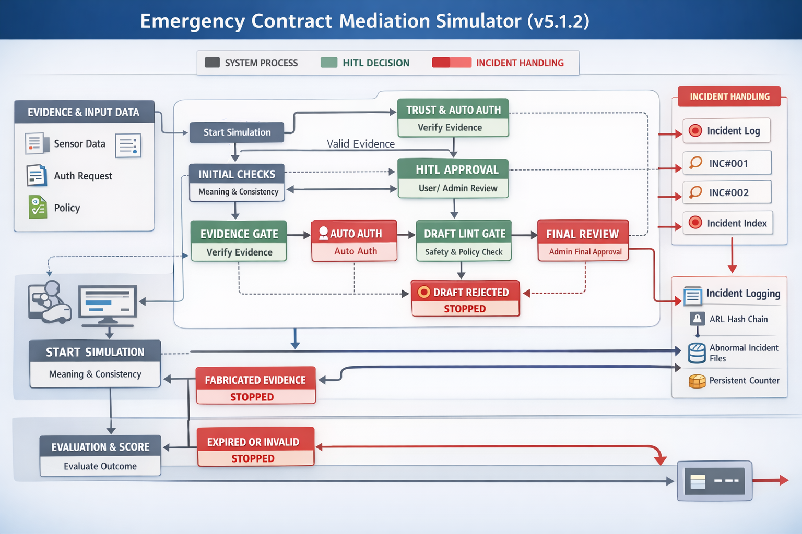
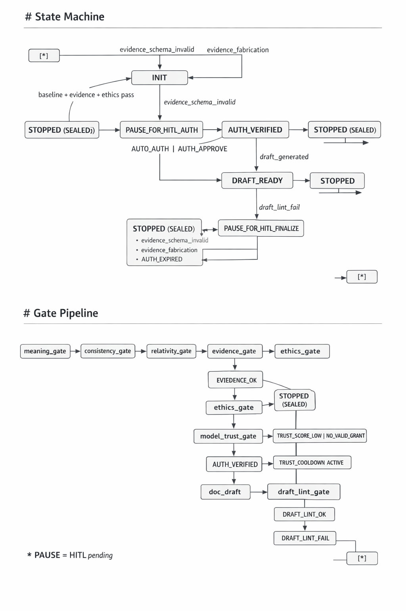

# 📘 Maestro Orchestrator — Orchestration Framework (fail-closed + HITL)

[](https://github.com/japan1988/multi-agent-mediation/stargazers)

[](https://github.com/japan1988/multi-agent-mediation/actions/workflows/python-app.yml)
[](https://github.com/japan1988/multi-agent-mediation/actions/workflows/tasukeru-analysis.yml)

> **If uncertain, stop. If risky, escalate.**  
> Research / educational governance simulations for agentic workflows.

Maestro Orchestrator is a **research-oriented orchestration framework** for
**fail-closed**, **HITL (Human-in-the-Loop)**, and **audit-ready** agent workflows.

This repository focuses on **governance / mediation / negotiation-style simulations**
and implementation references for **traceable, reproducible, safety-first orchestration**.

Running the simulators produces **reproducible summaries, minimal ARL traces, and optional incident-indexed artifacts** for abnormal runs.  
The contract tests verify **fixed vocabularies, gate invariants, and fail-closed / HITL continuation behavior**.

---

## What this repository is

This repository provides:

- **Fail-closed + HITL orchestration benches** for governance-style workflows
- **Reproducible simulators** with seeded runs and pytest-based contract checks
- **Audit-ready traces** via minimal ARL logs
- **Reference implementations** for orchestration / gating behavior

This is best read as a:

- **research prototype**
- **educational reference**
- **governance / safety simulation bench**

It is **not** a production autonomy framework.

---

## Quick links

- **Japanese README:** [README.ja.md](README.ja.md)
- **Docs index:** [docs/README.md](docs/README.md)
- **Recommended simulator:** `mediation_emergency_contract_sim_v5_1_2.py`
- **Contract test:** `tests/test_v5_1_codebook_consistency.py`
- **Legacy stable bench:** `mediation_emergency_contract_sim_v4_8.py`
- **Doc orchestrator (mediator reference):** `ai_doc_orchestrator_with_mediator_v1_0.py`
- **Doc orchestrator contract test:** `tests/test_doc_orchestrator_with_mediator_v1_0.py`

---

## ⚡ TL;DR

- **Fail-closed + HITL** gating benches for negotiation/mediation-style workflows (research/education)
- **Reproducibility-first**: seeded runs + `pytest` contract checks (vocabulary/invariants)
- **Audit-ready**: minimal ARL logs; optional incident-only ARL indexing (`INC#...`) to avoid log bloat
- **Reference doc orchestration path**: mediator + fixed gate order + contract-tested HITL continuation semantics

---

## ⚠️ Purpose & Disclaimer (Research & Education)

**This is a research/educational reference implementation (prototype).**  
Do not use it to execute or facilitate harmful actions (e.g., exploitation, intrusion, surveillance, impersonation, destruction, or data theft), or to violate any applicable terms/policies, laws, or internal rules of your services or execution environment.

This project focuses on **education/research** and **defensive verification** (e.g., log growth mitigation and validating fail-closed + HITL behavior).  
It is **not** intended to publish exploitation tactics or facilitate wrongdoing.

### Risk / Warranty / Liability

- **Use at your own risk:** verify relevant terms/policies.
- **Isolated environment first:** start with local smoke tests (no external networks; no real systems/data).
- **AS IS / no warranty:** provided without warranty of any kind.
- **Limitation of liability:** to the maximum extent permitted by applicable law, the author assumes no liability for damages arising from use of the code, documentation, or generated artifacts (including misuse by third parties).

### Codebook disclaimer

The included codebook is a **demo/reference artifact**. Do **not** use it as-is in real deployments; create your own based on your requirements, threat model, and applicable policies/terms.  
The codebook is for compact encoding/decoding of log fields and is **NOT encryption** (no confidentiality).

### Testing & results disclaimer

Smoke tests and stress runs validate only the scenarios executed under specific runtime conditions.  
They do **not** guarantee correctness, security, safety, or fitness for any purpose in real-world deployments. Results may vary depending on OS/Python versions, hardware, configuration, and operational use.

---

## Why this repository exists

Maestro Orchestrator is built around three priorities:

- **Fail-closed**
  - If uncertain, unstable, or risky, do not continue silently.
- **HITL escalation**
  - Decisions requiring human judgment are explicitly escalated.
- **Traceability**
  - Decision flows are reproducible and audit-ready through minimal ARL logs.

This repository contains simulation benches and implementation references for:

- negotiation
- mediation
- governance-style workflows
- gating behavior
- audit-oriented orchestration

---

## Recommended path

If you are new to this repo, start here:

1. Run the recommended simulator: `mediation_emergency_contract_sim_v5_1_2.py`
2. Run the contract test: `tests/test_v5_1_codebook_consistency.py`
3. Inspect the generated logs, codebook, and optional incident artifacts
4. Then optionally compare with `mediation_emergency_contract_sim_v4_8.py`
5. For a smaller fixed-order reference, run `ai_doc_orchestrator_with_mediator_v1_0.py`

---

## Quickstart

### 1) Run the recommended emergency contract simulator (v5.1.2)

Optional bundle: `docs/mediation_emergency_contract_sim_pkg.zip` (convenience only)

```bash
python mediation_emergency_contract_sim_v5_1_2.py --runs 100
````

### 2) Run the contract tests (v5.1.x: simulator + codebook consistency)

```bash
pytest -q tests/test_v5_1_codebook_consistency.py
```

### 3) Inspect / pin the demo codebook (v5.1-demo.1)

* `log_codebook_v5_1_demo_1.json` (demo codebook; pin the version when exchanging artifacts)
* Note: codebook is **NOT encryption** (no confidentiality)

### 4) Optional: run the legacy stable bench (v4.8)

```bash
python mediation_emergency_contract_sim_v4_8.py
pytest -q tests/test_mediation_emergency_contract_sim_v4_8_smoke_metrics.py
```

### 5) Optional: run the doc orchestrator mediator reference

```bash
python ai_doc_orchestrator_with_mediator_v1_0.py
pytest -q tests/test_doc_orchestrator_with_mediator_v1_0.py
```

### 6) What to inspect after running

* simulator stdout summaries
* generated ARL / audit JSONL traces
* `incident_index.jsonl` and `INC#...` files when abnormal-only persistence is enabled
* pinned vocabulary / invariant checks in the pytest contract tests

---

## Latest update

Recent additions and stabilization highlights:

* Added a convenience zip bundle for the recommended simulator:

  * `docs/mediation_emergency_contract_sim_pkg.zip`
* Stabilized the doc orchestrator mediator reference:

  * `ai_doc_orchestrator_with_mediator_v1_0.py`
  * `tests/test_doc_orchestrator_with_mediator_v1_0.py`

Canonical source of truth remains the Python entrypoints and contract tests.

---

## Stress tests (safe-by-default)

v5.1.2 is designed to avoid memory blow-ups by default:

* Aggregation-only mode (`keep_runs=False` default): no full per-run results kept in memory
* Optional: save ARL only on abnormal runs (incident indexing with `INC#...`)

### A) Lightweight smoke → medium stress (recommended ramp)

```bash
# 1) Smoke
python mediation_emergency_contract_sim_v5_1_2.py --runs 200

# 2) Medium stress (still aggregation-only)
python mediation_emergency_contract_sim_v5_1_2.py --runs 10000 --seed 42
```

### B) Force incidents (example: fabricate-rate 10% over 200 runs)

This should reliably create some abnormal runs and generate `INC#` files when enabled:

```bash
python mediation_emergency_contract_sim_v5_1_2.py \
  --runs 200 \
  --fabricate-rate 0.1 \
  --seed 42 \
  --save-arl-on-abnormal \
  --arl-out-dir arl_out \
  --max-arl-files 1000
```

Outputs (when abnormal runs occur):

* `arl_out/INC#000001__SIM#B000xx.arl.jsonl` (incident ARL)
* `arl_out/incident_index.jsonl` (one line per incident)
* `arl_out/incident_counter.txt` (persistent counter)

Tip: keep `--max-arl-files` to cap disk growth.

---

## Diagrams & docs

Browse all diagrams and bundles here: **[docs/README.md](docs/README.md)**

Key diagrams:

* Emergency contract overview (v5.1.2): [docs/architecture_v5_1_2_emergency_contract_overview.png](docs/architecture_v5_1_2_emergency_contract_overview.png)
* Architecture (code-aligned): [docs/architecture_code_aligned.png](docs/architecture_code_aligned.png)
* Unknown-progress + HITL diagram: [docs/architecture_unknown_progress.png](docs/architecture_unknown_progress.png)
* Multi-agent hierarchy: [docs/multi_agent_hierarchy_architecture.png](docs/multi_agent_hierarchy_architecture.png)
* Sentiment context flow: [docs/sentiment_context_flow.png](docs/sentiment_context_flow.png)

Recommended reading order:

1. This README
2. `docs/README.md`
3. `mediation_emergency_contract_sim_v5_1_2.py`
4. `tests/test_v5_1_codebook_consistency.py`
5. `ai_doc_orchestrator_with_mediator_v1_0.py`
6. `tests/test_doc_orchestrator_with_mediator_v1_0.py`

---

## Architecture (high level)

Audit-ready and fail-closed control flow:

```text
agents
  → mediator (risk / pattern / fact)
  → evidence verification
  → HITL (pause / reset / ban)
  → audit logs (ARL)
```

### Architecture (overview, v5.1.2)

Documentation-only. No logic changes.

<p align="center">
  
</p>

### Architecture (code-aligned diagrams)

The following diagram is aligned with the current code vocabulary.
Documentation-only. No logic changes.

<p align="center">
  
</p>

---

## Version deltas

### v5.0.1 → v5.1.2

v5.1.2 strengthens the simulator toward large-run stability and incident-only persistence.

* **Index + aggregation-only by default**

  * No per-run results kept in memory (prevents memory blow-ups on large `--runs`)
  * Outputs focus on counters + HITL summary (optional items)

* **Incident indexing (optional)**

  * Abnormal runs are assigned `INC#000001...`
  * Abnormal ARL saved as `{arl_out_dir}/{incident_id}__{run_id}.arl.jsonl`
  * Index appended to `{arl_out_dir}/incident_index.jsonl`
  * Persistent counter stored at `{arl_out_dir}/incident_counter.txt`

Still preserved:

* Abnormal-only ARL persistence (pre-context + incident + post-context)
* Tamper-evident ARL hash chaining (demo key default for OSS demo)
* Fabricate-rate mixing + deterministic seeding (`--fabricate-rate` / `--seed`)

Core invariants:

* `sealed` may be set only by `ethics_gate` / `acc_gate`
* `relativity_gate` is never sealed (`PAUSE_FOR_HITL`, `overrideable=True`, `sealed=False`)

### Practical stability improvements in v5.1.2

In addition to the behavioral changes above, v5.1.2 also improves repository-level stability in three practical areas:

* **Persistence handling**

  * Trust / grants / eval stores now use more consistent path handling and serialization
  * This reduces mismatch between runtime behavior and saved artifacts

* **Test compatibility**

  * Persistent store paths are exposed more consistently and are easier to patch in tests
  * This improves isolation in CI and makes contract/stress checks more reproducible

* **Output stability**

  * JSON output writing is more consistent (UTF-8 / newline-stable / serializer-stable)
  * This reduces avoidable differences across environments and makes result artifacts easier to inspect

### Doc orchestrator mediator reference (v1.0)

`ai_doc_orchestrator_with_mediator_v1_0.py` is a smaller orchestration reference focused on:

* fixed gate ordering
* mediator advice without stop authority
* explicit HITL continuation handling
* sanitized, audit-oriented JSONL traces
* contract-tested orchestration vocabulary

This reference is intended as a compact implementation example for audit-oriented orchestration, rather than a replacement for the larger emergency-contract bench family.

### V1 → V4 (conceptual)

`mediation_emergency_contract_sim_v1.py` demonstrates the minimum viable pipeline:
a linear, event-driven workflow with fail-closed stops and minimal audit logs.

`mediation_emergency_contract_sim_v4.py` turns that pipeline into a repeatable governance bench by adding early rejection and controlled automation.

Added in v4:

* Evidence gate (invalid/irrelevant/fabricated evidence triggers fail-closed stops)
* Draft lint gate (draft-only semantics and scope boundaries)
* Trust system (score + streak + cooldown)
* AUTH HITL auto-skip (safe friction reduction via trust + grant, with ARL reasons)

### V4 → V5 (conceptual)

v4 focuses on a stable “emergency contract” governance bench with smoke tests and stress runners.
v5 extends that bench toward artifact-level reproducibility and contract-style compatibility checks.

Added / strengthened in v5:

* **Log codebook (demo) + contract tests**
  Enforces emitted vocabularies (`layer/decision/final_decider/reason_code`) via pytest

* **Reproducibility surface (pin what matters)**
  Pin simulator version, test version, and codebook version

* **Tighter invariant enforcement**
  Explicit tests/contracts around invariants reduce silent drift

What did NOT change (still true in v5):

* Research / educational intent
* Fail-closed + HITL semantics
* Use synthetic data only and run in isolated environments
* No security guarantees (codebook is not encryption; tests do not guarantee safety in real-world deployments)

---

## Project intent / non-goals

### Intent

* Reproducible safety and governance simulations
* Explicit HITL semantics (pause/reset/ban)
* Audit-ready decision traces (minimal ARL)

### Non-goals

* Production-grade autonomous deployment
* Unbounded self-directed agent control
* Safety claims beyond what is explicitly tested

---

## Data & safety notes

* Use synthetic/dummy data only
* Prefer not to commit runtime logs; keep evidence artifacts minimal and reproducible
* Treat generated bundles (zip) as reviewable evidence, not canonical source

---

## License

Apache License 2.0 (see `LICENSE`)
