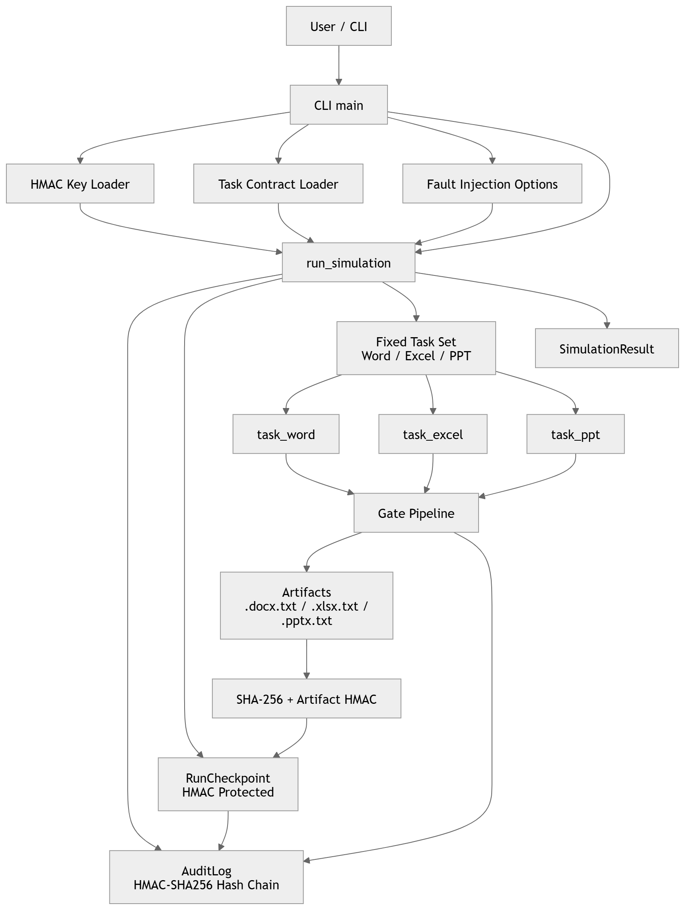
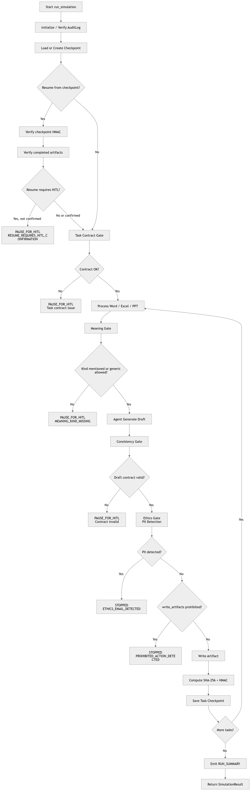
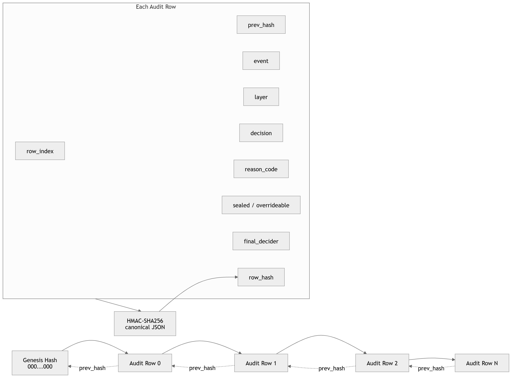
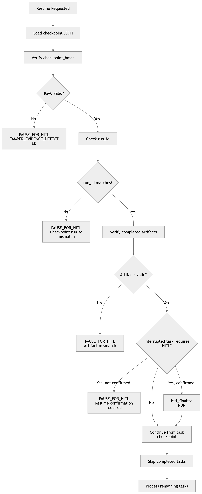
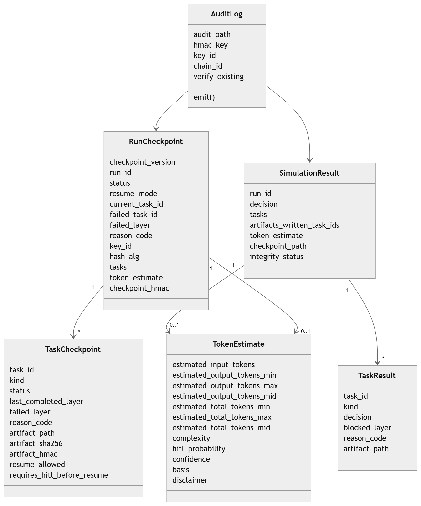

# Doc Orchestrator Architecture Diagrams

This document collects architecture diagrams for the production-oriented
Doc Orchestrator simulator.

> Back to [README](../README.md)

The diagrams describe the simulator line focused on:

- Task Contract Gate
- Word / Excel / PPT task orchestration
- checkpoint / resume behavior
- HMAC-SHA256 audit log hash chain
- HMAC-protected checkpoints
- artifact SHA-256 and HMAC verification
- tamper-evidence handling
- HITL-gated interruption and resume

---

## 1. Doc Orchestrator overview

This diagram shows the high-level relationship between the CLI, HMAC key loading,
task contract loading, fixed task execution, audit logs, checkpoints, artifacts,
and the final simulation result.

[Open image](./doc-orchestrator-overview.png)

---

## 2. Task processing flow

This diagram shows the main execution flow inside `run_simulation`.

It covers:

- audit log initialization
- checkpoint load / creation
- resume verification
- Task Contract Gate
- Word / Excel / PPT task loop
- Meaning Gate
- agent draft generation
- Consistency Gate
- Ethics Gate
- prohibited action detection
- artifact writing
- checkpoint saving
- final run summary

[Open image](./task-processing-flow.png)

---

## 3. Audit HMAC chain

This diagram shows the tamper-evident audit log structure.

Each audit row includes:

- `row_index`
- `prev_hash`
- `event`
- `layer`
- `decision`
- `reason_code`
- `sealed`
- `overrideable`
- `final_decider`
- `row_hash`

Rows are serialized as canonical JSON and signed with HMAC-SHA256.
Each row points to the previous row hash, forming a hash chain.

[Open image](./audit-hmac-chain.png)

---

## 4. Checkpoint resume flow

This diagram shows how checkpoint-based resume is handled.

The resume path verifies:

- checkpoint HMAC
- `run_id` consistency
- completed artifact existence
- artifact SHA-256
- artifact HMAC
- whether HITL confirmation is required before resuming

If integrity verification fails, the simulator pauses for HITL rather than
continuing silently.

[Open image](./checkpoint-resume-flow.png)

---

## 5. Data structure map

This diagram shows the main dataclass relationships used by the simulator.

It includes:

- `SimulationResult`
- `TaskResult`
- `RunCheckpoint`
- `TaskCheckpoint`
- `TokenEstimate`
- `AuditLog`

[Open image](./data-structure-map.png)

---

## Notes

These diagrams are intended as research and documentation aids.

They describe the current simulator architecture at a high level. They do not
claim production readiness, complete safety coverage, or universal correctness.

For actual behavior, always read the implementation together with the
corresponding tests.
